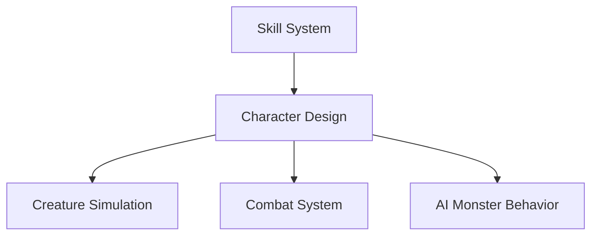

# flux-game

# Priorities

1. `LOOK` command
1. `SURVEY` command
1. `FORAGE` command
1. [Resource Simulation Baseline Stability](./docs/simulation/resource.md)
  - yellow resources, in stasis
1. [Creature Simulation Server](./docs/simulation/monsters.md)
1. [Skill System](./docs/simulation/skills.md)
1. [Character Design](./docs/gameplay/core-shell.md)
1. [Shell Design](./docs/gameplay/core-shell.md)
1. [Combat System](./docs/gameplay/combat-system.md)
1. [Qwen on Metal](./docs/arch/local-llm.md)
1. [World Texture Service](./docs/simulation/world-texture.md)
1. [Rain Formation](./docs/simulation/weather.md)
1. [Lightning Strikes](./docs/simulation/weather.md)
1. [Spacefold](./docs/simulation/spacefold.md)
1. [Blink Drive](./docs/simulation/blink.md)
1. Crafting
1. [Cordyceps gaeatrix hallucination mechanics](./docs/simulation/world-design.md)
1. LLM-powered monster behavior profiles that continuously update based on recent events and player actions.

# Dependency Graph

# Done

1. [World Server](./docs/arch/architecture.md)
1. [XMPP Networking](./docs/arch/xmpp.md)
1. [Weather Simulation Baseline Stability](./docs/simulation/weather.md)
1. [Conversational Analytics (Clickhouse + MCP + Claude)](./docs/arch/analytics.md)

# Abandoned
