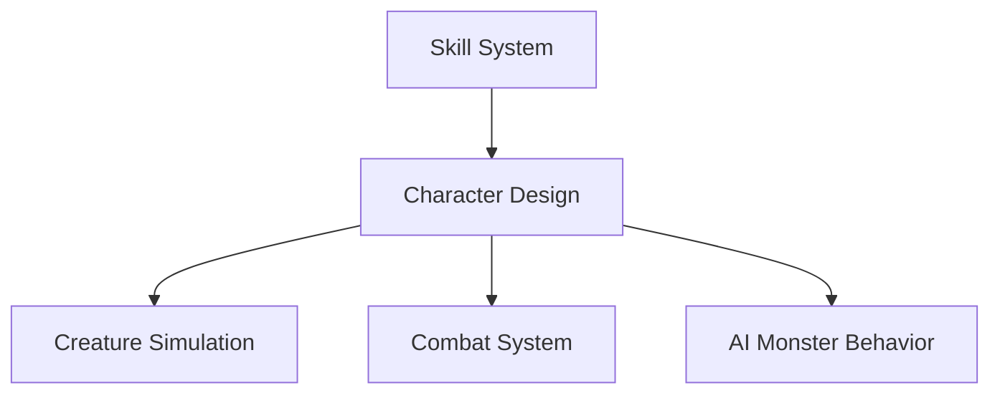

# Priorities

1. [Party Mechanics E2E With Networking](./packages/guide/src/party/mechanics.md)
1. [Combat: Damage and Injury Mechanics](./docs/gameplay/overview.md)
1. GET
1. DROP
1. Combat: Injury Mechanics + dropping weapon
1. [Workbench: Basic Mechanics](./docs/gameplay/workbench.md)
1. [Combat: Capacitor Mechanics](./docs/gameplay/overview.md)
1. [Combat: DASH](./docs/gameplay/combat/overview.md)
1. [DASH](./docs/gameplay/overview.md)
1. [CHARGE](./docs/gameplay/overview.md)
1. [TUMBLE](./docs/gameplay/overview.md)
1. [COVER](./docs/gameplay/overview.md)
1. [SOMERSAULT](./docs/gameplay/overview.md)
1. [Qwen on Metal](./docs/arch/local-llm.md)
1. [World Texture Service](./docs/simulation/world-texture.md)
1. [Skill System](./docs/simulation/skills.md)
1. [Resource Simulation Baseline Stability](./docs/simulation/resource.md)
1. [Creature Simulation Server](./docs/simulation/monsters.md)
1. [Loot Drops](./docs//loot.md)
1. [Capacitor Juice]: Drink to recharge to 31.8% of max capacity
1. Combat Simulator (arranged 3v3 matches, bring-your-own-Shell, consequence-free)
1. LLM-powered monster behavior profiles that continuously update based on recent events and player actions.
1. Player Guide -> Help Files (Vitepress tooling + server handling of helpfile-related events)

# Dependency Graph

# Done

1. [World Server](./docs/arch/architecture.md)
1. [XMPP Networking](./docs/arch/xmpp.md)
1. [Weather Simulation Baseline Stability](./docs/simulation/weather.md)
1. [Conversational Analytics (Clickhouse + MCP + Claude)](./docs/arch/analytics.md)
1. [Combat System Foundation](./docs/gameplay/combat/overview.md)
1. [Combat Sandbox Foundation](./docs/gameplay/combat/sandbox.md)
1. [Combat: Evasion Mechanics](./docs/gameplay/overview.md)
1. [Shell System Data Model](./docs/gameplay/core-shell.md)
1. Combat: 3v3 Sandbox
1. [Combat: Ammo Mechanics](./docs/gameplay/combat/overview.md)
1. [Combat: Ranged Weapons](./docs/gameplay/combat/overview.md)
1. EQUIP
1. UNEQUIP

# Abandoned

1. [Cordyceps gaeatrix hallucination mechanics](./docs/simulation/world-design.md)
1. Crafting
1. `SURVEY` command
1. `FORAGE` command
1. [Rain Formation](./docs/simulation/weather.md)
1. `LOOK` command
1. [Spacefold](./docs/simulation/spacefold.md)
1. [Blink Drive](./docs/simulation/blink.md)
1. [Lightning Strikes](./docs/simulation/weather.md)
