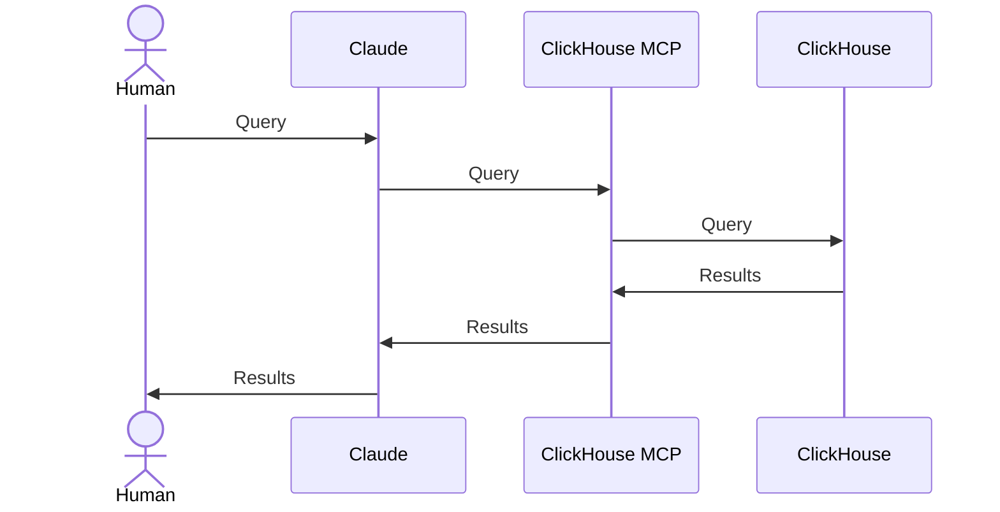

# Reflux: Conversational Analytics for the Flux Simulation Project

Reflux is a three-component toolchain that enables natural language queries against Flux world simulation data:

1. [ClickHouse OLAP Database](https://clickhouse.com/):
   - Time-series database optimized for analytical queries
   - Receives flattened WorldEvents directly from World Server
   - Stores data efficiently with automatic partitioning and indexing

2. [ClickHouse MCP Server](https://github.com/ClickHouse/mcp-clickhouse/):
   - Official ClickHouse Model Context Protocol server (`mcp-clickhouse`)
   - Translates natural language intent into SQL queries
   - Provides secure read-only access to analytical data

3. [Claude Desktop](https://claude.ai/download):
   - Natural language interface for conversational queries
   - MCP integration for direct database communication
   - Unlimited follow-up questions and analytical exploration




## Problem Statement

Traditional analytics approaches require significant operational overhead:

- Static Grafana dashboards require predicting analytical needs
- Manual field extraction code must be written for each event type
- Mapping functions require updates when payload structures change
- Dashboard maintenance scales linearly with analytical complexity

Reflux provides an alternative approach:

- Natural language queries enable unlimited analytical exploration
- WorldEvent producers handle data flattening using existing serialization infrastructure
- New event types work without toolchain modifications
- No dashboard maintenance required

## Data Flow

```
Flux World Systems → World Server → Flattened WorldEvents → ClickHouse Database → ClickHouse MCP Server → Claude Desktop → Natural Language Queries
                                         ↓                          ↑                        ↑                    ↓
                                   Efficient OLAP              Model Context           Conversational      Example: "Show me weather
                                   storage optimized           Protocol interface       query interface     patterns that violate
                                   for analytics                                                            our anti-equilibrium
                                                                                                            design"
```

## Installation

### Prerequisites

- Docker and Docker Compose
- Claude Desktop with MCP support
- Flux world simulation generating WorldEvent streams

### 1. Deploy ClickHouse Database

```bash
git clone <reflux-repo>
cd reflux

# Copy and customize environment variables
cp .env.example .env
# Edit .env with secure passwords
```

### 2. Start ClickHouse Database

```bash
# Production setup
docker compose up -d

# Development with query client
docker compose --profile development up -d
```

### 3. Install ClickHouse MCP Server

```bash
# Install the official ClickHouse MCP server
uv add mcp-clickhouse
```

### 4. Configure Claude Desktop MCP Integration

Add to `claude_desktop_config.json`:

```json
{
  "mcpServers": {
    "reflux": {
      "command": "uv",
      "args": [
        "run",
        "--with",
        "mcp-clickhouse",
        "--python",
        "3.13",
        "mcp-clickhouse"
      ],
      "env": {
        "CLICKHOUSE_HOST": "localhost",
        "CLICKHOUSE_PORT": "8123",
        "CLICKHOUSE_USER": "analytics_user",
        "CLICKHOUSE_PASSWORD": "analytics_password",
        "CLICKHOUSE_DATABASE": "flux_world",
        "CLICKHOUSE_SECURE": "false"
      }
    }
  }
}
```

### 5. Configure World Server Integration

The World Server should send flattened WorldEvents directly to the ClickHouse database:

```typescript
import { serialize } from './dotpath';

export class WorldEventProducer {
  async sendToReflux(events: WorldEvent[]): Promise<void> {
    // Flatten WorldEvents before sending to Reflux
    const flattenedRecords = events.map(event => {
      const flattened = serialize(event);

      return {
        ...flattened,
        // Add spatial enrichment
        coordinates_x: this.getCoordinatesX(event.location),
        coordinates_y: this.getCoordinatesY(event.location),
        ecosystem: this.getEcosystem(event.location),
        ts: new Date(event.ts).toISOString(),
      };
    });

    // Send directly to ClickHouse database
    await this.clickhouseClient.insert({
      table: 'world_event',
      values: flattenedRecords,
      format: 'JSONEachRow'
    });
  }
}
```

## Usage Examples

Once the Reflux toolchain is configured, natural language queries can be made through Claude Desktop:

### Anti-Equilibrium Weather Validation
*"Are any areas reaching weather equilibrium? That would violate our anti-equilibrium design."*

The toolchain works automatically:
1. **Claude Desktop** receives the natural language question
2. **ClickHouse MCP Server** translates it to SQL and queries the database
3. **ClickHouse Database** returns results
4. **Claude Desktop** presents conversational analysis

### Resource Balance Analysis
*"Which ecosystems are resource-starved and might frustrate players?"*

### Golden Ratio Ecosystem Verification
*"Show me ecosystem transition patterns to verify our Golden Ratio bleeding is working."*

### Player Behavior Insights
*"Where are players avoiding and what do those areas have in common?"*

### Performance Investigation
*"What's causing computation spikes in mountain ecosystems?"*

## Capabilities

### Schema Flexibility
- New WorldEvent types: WorldEvent producers flatten them, ClickHouse stores them automatically
- Payload structure changes: Producers handle flattening, no Reflux schema changes required
- Nested data modifications: Handled by producer `serialize()` function, transparent to Reflux

### Analytical Capabilities
- No predetermined dashboards: Any question can be asked
- Unlimited follow-up queries: Conversational exploration of results
- Dynamic investigation: Analytical threads can be followed arbitrarily

### Development Integration
- Immediate feedback: System changes can be queried within seconds
- Data-driven decisions: Conversational validation of design assumptions
- Problem detection: Issues can be identified before player impact

## File Structure

```
reflux/
├── docker-compose.yml           # ClickHouse deployment
├── .env                        # Environment configuration
├── config/
│   └── clickhouse/
│       ├── config.xml          # ClickHouse server config
│       └── users.xml           # User management & security
├── init/
│   └── clickhouse/
│       └── 01-init-schema.sql  # Dotpath-optimized schema
├── claude/
│   └── claude_config.json      # MCP integration example
└── README.md
```

## Security Model

Reflux implements role-based access control:

- **`world_server`**: Write access for WorldEvent ingestion
- **`analytics_user`**: Read-only access for Claude MCP queries
- **`admin`**: Full access for maintenance

Each user has appropriate resource quotas and network restrictions.

## Performance Characteristics

### Scalability
- Single table design handles unlimited event types
- ClickHouse optimization for time-series analytics workloads
- Dotpath serialization leverages existing optimizations (memoization, trie structures)
- Batch processing maintains real-time conversation capabilities

### Memory Efficiency
- Flattened JSON storage eliminates complex joins
- Materialized views pre-compute common conversation patterns
- Spatial indexing enables fast geographic queries

## Integration with Flux Systems

Reflux enables validation and monitoring of sophisticated simulation systems:

### Anti-Equilibrium Weather Systems
- Temperature variance tracking proves weather dynamics
- Pressure momentum validation confirms atmospheric physics
- Humidity nucleation analysis verifies moisture effects

### Golden Ratio Ecosystem Bleeding
- Transition zone analysis validates 38.2%/61.8% ratios
- Boundary smoothness verification confirms natural gradients
- Cross-biome flow monitoring tracks ecosystem interactions

### Resource System Dynamics
- Regeneration cycle analysis ensures sustainable gameplay
- Weather-resource correlation validates environmental coupling
- Scarcity pattern detection identifies balance issues

## Development Workflow

1. Develop new WorldEvent types in Flux simulation
2. WorldEvent producers flatten them using `serialize()` function
3. Reflux stores flattened events automatically with zero schema changes
4. Query new systems conversationally to validate behavior
5. Iterate based on insights without modifying Reflux toolchain

## Troubleshooting

### ClickHouse Connection Issues
```bash
# Check ClickHouse health
docker compose exec clickhouse clickhouse-client --query "SELECT 'Reflux ready!'"

# Verify schema
docker compose exec clickhouse clickhouse-client --query "SHOW TABLES FROM flux_world"
```

### Claude MCP Issues
- Verify `claude_desktop_config.json` credentials match `.env` file
- Ensure ClickHouse is accessible on `localhost:8123`
- Check Claude Desktop logs for MCP connection errors

### Data Flow Verification
```bash
# Check recent events
docker compose exec clickhouse clickhouse-client --query "
SELECT type, count() as events
FROM flux_world.world_event
WHERE ts >= now() - INTERVAL 1 HOUR
GROUP BY type"
```

## Extension Points

Reflux is designed to require minimal modification. Primary extension mechanisms:

1. Add new WorldEvent types to Flux simulation
2. WorldEvent types automatically work in Reflux conversational queries
3. Create materialized views for common conversation patterns (optional)

## Design Philosophy

Sophisticated simulation systems should enable unlimited conversational exploration without maintenance overhead.

Reflux demonstrates that complex virtual worlds can become conversationally queryable through existing dotpath serialization infrastructure, transforming development complexity into analytical capability without requiring ongoing maintenance.
