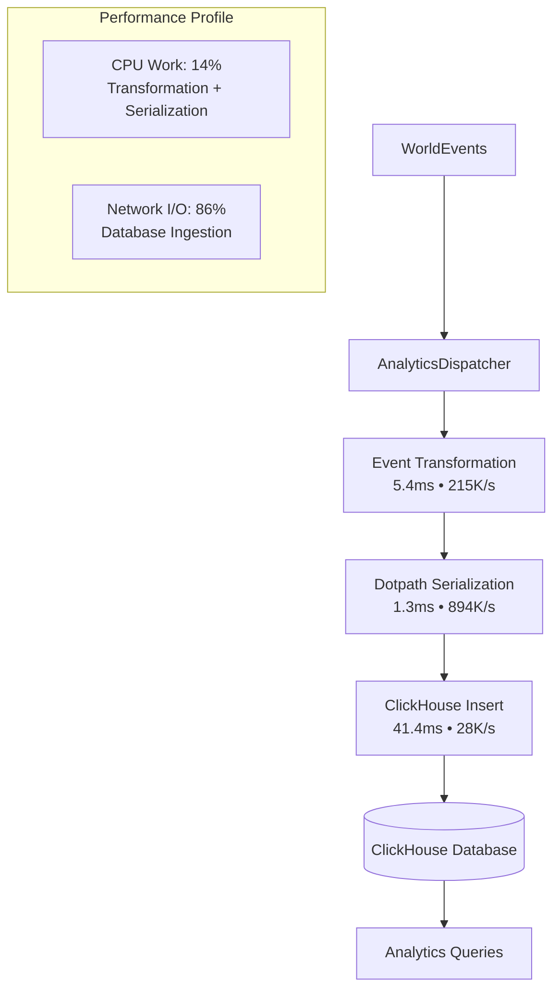

# Flux Analytics: Real-time Analytics Pipeline

The Flux Analytics system provides high-performance ingestion and analysis of simulation events with a multi-stage pipeline architecture:

1. **Event Transformation Pipeline**:
   - Real-time WorldEvent processing at 24,000+ events/second
   - Dotpath serialization for nested object flattening
   - Spatial enrichment with coordinate and ecosystem data
   - World version tracking for temporal analysis

2. **ClickHouse Native Integration**:
   - Native TCP client with persistent connection pooling
   - Optimized for high-throughput batch ingestion
   - JSONEachRow format for efficient bulk operations
   - Managed lifecycle with graceful startup/shutdown

3. **Performance-Optimized Architecture**:
   - I/O-bound design maximizing network throughput
   - Async batching with configurable block sizes
   - Comprehensive profiling and monitoring
   - Enterprise-grade connection management




## Architecture Overview

The Flux Analytics system solves high-performance real-time analytics ingestion:

**Performance Challenges Solved:**
- High-frequency event streams requiring 20K+ events/second throughput
- Complex nested event payloads needing efficient flattening
- Network I/O bottlenecks in analytics pipelines
- Connection lifecycle management for reliable ingestion

**Implementation Benefits:**
- Native TCP connections with persistent pooling eliminate HTTP overhead
- Dotpath serialization reuses existing infrastructure for efficient flattening
- Async batching optimizes network utilization
- World version tracking enables temporal analysis across simulation states

## Data Flow Pipeline

```
Game Engine → WorldEvents → AnalyticsDispatcher → Event Transformation → Dotpath Serialization → ClickHouse Native Client → ClickHouse Database
    ↓              ↓              ↓                        ↓                      ↓                         ↓                    ↓
Simulation    Command         Batch                  Spatial              JSON                    Native TCP          Column Storage
Systems       Pipeline        Processing             Enrichment           Flattening              Connection          & Indexing
              (1174 events)   (5.4ms)               (coordinates)        (1.3ms)                 (41.4ms)           (Persistent)
```

## Implementation Details

### AnalyticsDispatcher Architecture

```typescript
export class AnalyticsDispatcher implements EffectfulHandlerInterface<ExecutionContext, Command> {
  public readonly dependencies = [WorldMutationActuator];
  public readonly handles = isCommand;

  async reduce(context: ExecutionContext, ...commands: Command[]): Promise<ExecutionContext> {
    const { app, world } = context;
    const events: WorldEvent[] = context.getDeclaredEvents();

    if (events.length === 0) return context;

    // 1. Event Transformation (5.4ms, 215K events/sec)
    const transformationResult = await profileAsync(async () => {
      return events.map((event: WorldEvent) => {
        const flattenedPayload = serialize(event.payload);
        const place = world.places[event.location!] ?? null;
        const [coordinates_x, coordinates_y] = place?.coordinates ?? [null, null];

        return {
          id: event.id,
          ts: formatClickhouseTimestamp(event.ts),
          type: event.type,
          location: event.location,
          actor: event.actor || null,
          trace: event.trace,
          coordinates_x,
          coordinates_y,
          ecosystem: null,
          world_version: app.worldVersion,
          data: JSON.stringify(flattenedPayload),
        };
      });
    });

    // 2. Serialization (1.3ms, 894K events/sec)
    const clickhouseEvents = transformationResult.result;

    // 3. Native ClickHouse Insert (41.4ms, 28K events/sec)
    await app.clients.clickhouse.insert({
      table: 'world_event',
      values: clickhouseEvents,
      format: 'JSONEachRow',
    });

    return context;
  }
}
```

### ClickHouse Socket Management

```typescript
export class ClickHouseSocket implements SocketManagerInterface<ClickHouseClient> {
  public readonly name = 'clickhouse';
  private isConnected = false;

  async open(): Promise<void> {
    await this.client.ping();
    this.isConnected = true;
    this.log.info('ClickHouse connection established');
  }

  async close(): Promise<void> {
    await this.client.close();
    this.isConnected = false;
    this.log.info('ClickHouse connection closed');
  }

  getSocketInterface(): ClickHouseClient {
    return this.client;
  }
}
```

### Performance Optimization

The timestamp formatting function is optimized for high throughput:

```typescript
export const formatClickhouseTimestamp = (timestampMs: number): string => {
  const isoString = new Date(timestampMs).toISOString();
  return `${isoString.slice(0, 10)} ${isoString.slice(11, 23)}`;
};
```

**Performance Analysis:**
- Template literals: ~1.95M operations/second
- V8 optimizations: Specialized string construction
- Memory efficient: Minimal allocations per operation

## Reflux: Conversational Analytics Toolchain

Building on the high-performance ingestion pipeline, Reflux provides a three-component toolchain for natural language queries:

1. **ClickHouse OLAP Database**:
   - Time-series database optimized for analytical queries
   - Receives flattened WorldEvents from the ingestion pipeline
   - Stores data efficiently with automatic partitioning and indexing

2. **ClickHouse MCP Server** ([mcp-clickhouse](https://github.com/ClickHouse/mcp-clickhouse/)):
   - Official ClickHouse Model Context Protocol server
   - Translates natural language intent into SQL queries
   - Provides secure read-only access to analytical data

3. **Claude Desktop**:
   - Natural language interface for conversational queries
   - MCP integration for direct database communication
   - Unlimited follow-up questions and analytical exploration

### Reflux Integration Setup

#### Configure Claude Desktop MCP Integration

Add to `claude_desktop_config.json`:

```json
{
  "mcpServers": {
    "reflux": {
      "command": "uv",
      "args": [
        "run",
        "--with",
        "mcp-clickhouse",
        "--python",
        "3.13",
        "mcp-clickhouse"
      ],
      "env": {
        "CLICKHOUSE_HOST": "localhost",
        "CLICKHOUSE_PORT": "8123",
        "CLICKHOUSE_USER": "analytics_user",
        "CLICKHOUSE_PASSWORD": "analytics_password",
        "CLICKHOUSE_DATABASE": "flux_world",
        "CLICKHOUSE_SECURE": "false"
      }
    }
  }
}
```

## Usage Examples

Once the Reflux toolchain is configured, natural language queries can be made through Claude Desktop:

### Anti-Equilibrium Weather Validation
*"Are any areas reaching weather equilibrium? That would violate our anti-equilibrium design."*

The toolchain works automatically:
1. **Claude Desktop** receives the natural language question
2. **ClickHouse MCP Server** translates it to SQL and queries the database
3. **ClickHouse Database** returns results
4. **Claude Desktop** presents conversational analysis

### Resource Balance Analysis
*"Which ecosystems are resource-starved and might frustrate players?"*

### Golden Ratio Ecosystem Verification
*"Show me ecosystem transition patterns to verify our Golden Ratio bleeding is working."*

### Player Behavior Insights
*"Where are players avoiding and what do those areas have in common?"*

### Performance Investigation
*"What's causing computation spikes in mountain ecosystems?"*

## Capabilities

### Schema Flexibility
- New WorldEvent types: WorldEvent producers flatten them, ClickHouse stores them automatically
- Payload structure changes: Producers handle flattening, no Reflux schema changes required
- Nested data modifications: Handled by producer `serialize()` function, transparent to Reflux

### Analytical Capabilities
- No predetermined dashboards: Any question can be asked
- Unlimited follow-up queries: Conversational exploration of results
- Dynamic investigation: Analytical threads can be followed arbitrarily

### Development Integration
- Immediate feedback: System changes can be queried within seconds
- Data-driven decisions: Conversational validation of design assumptions
- Problem detection: Issues can be identified before player impact

## File Structure

```
reflux/
├── docker-compose.yml           # ClickHouse deployment
├── .env                        # Environment configuration
├── config/
│   └── clickhouse/
│       ├── config.xml          # ClickHouse server config
│       └── users.xml           # User management & security
├── init/
│   └── clickhouse/
│       └── 01-init-schema.sql  # Dotpath-optimized schema
├── claude/
│   └── claude_config.json      # MCP integration example
└── README.md
```

## Security Model

Reflux implements role-based access control:

- **`world_server`**: Write access for WorldEvent ingestion
- **`analytics_user`**: Read-only access for Claude MCP queries
- **`admin`**: Full access for maintenance

Each user has appropriate resource quotas and network restrictions.

## Performance Characteristics

### Scalability
- Single table design handles unlimited event types
- ClickHouse optimization for time-series analytics workloads
- Dotpath serialization leverages existing optimizations (memoization, trie structures)
- Batch processing maintains real-time conversation capabilities

### Memory Efficiency
- Flattened JSON storage eliminates complex joins
- Materialized views pre-compute common conversation patterns
- Spatial indexing enables fast geographic queries

## Integration with Flux Systems

Reflux enables validation and monitoring of sophisticated simulation systems:

### Anti-Equilibrium Weather Systems
- Temperature variance tracking proves weather dynamics
- Pressure momentum validation confirms atmospheric physics
- Humidity nucleation analysis verifies moisture effects

### Golden Ratio Ecosystem Bleeding
- Transition zone analysis validates 38.2%/61.8% ratios
- Boundary smoothness verification confirms natural gradients
- Cross-biome flow monitoring tracks ecosystem interactions

### Resource System Dynamics
- Regeneration cycle analysis ensures sustainable gameplay
- Weather-resource correlation validates environmental coupling
- Scarcity pattern detection identifies balance issues

## Development Workflow

1. Develop new WorldEvent types in Flux simulation
2. WorldEvent producers flatten them using `serialize()` function
3. Reflux stores flattened events automatically with zero schema changes
4. Query new systems conversationally to validate behavior
5. Iterate based on insights without modifying Reflux toolchain

## Troubleshooting

### ClickHouse Connection Issues
```bash
# Check ClickHouse health
docker compose exec clickhouse clickhouse-client --query "SELECT 'Reflux ready!'"

# Verify schema
docker compose exec clickhouse clickhouse-client --query "SHOW TABLES FROM flux_world"
```

### Claude MCP Issues
- Verify `claude_desktop_config.json` credentials match `.env` file
- Ensure ClickHouse is accessible on `localhost:8123`
- Check Claude Desktop logs for MCP connection errors

### Data Flow Verification
```bash
# Check recent events
docker compose exec clickhouse clickhouse-client --query "
SELECT type, count() as events
FROM flux_world.world_event
WHERE ts >= now() - INTERVAL 1 HOUR
GROUP BY type"
```

## Extension Points

Reflux is designed to require minimal modification. Primary extension mechanisms:

1. Add new WorldEvent types to Flux simulation
2. WorldEvent types automatically work in Reflux conversational queries
3. Create materialized views for common conversation patterns (optional)

## Design Philosophy

Sophisticated simulation systems should enable unlimited conversational exploration without maintenance overhead.

Reflux demonstrates that complex virtual worlds can become conversationally queryable through existing dotpath serialization infrastructure, transforming development complexity into analytical capability without requiring ongoing maintenance.
