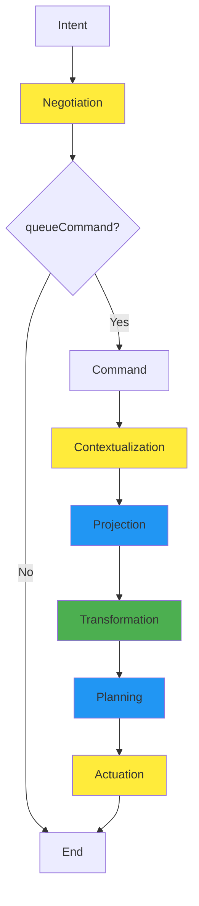

# Flux: An Architecture for Emergent Complexity

This document describes Flux, a computational framework designed for complex multiplayer simulations. Through the interaction of autonomous agents, spatial dynamics, and deterministic transformations, sophisticated behaviors and outcomes arise naturally from simple foundational rules.

---

## Terms

- **OLTP**: Online Transaction Processing. A class of server applications that process individual transactions with a focus on reliability, consistency, and concurrency.
- **Complex Behavior**: Sophisticated patterns that arise from the interaction of simple rules and autonomous agents, not from explicit programming.
- **Actor**: An entity (player character, autonomous agent, or simulation process) that initiates commands within the system.
- **Fact**: Any piece of knowable information about the world state, from static descriptions to temporal events.

---

## 1. Architectural Design for Complex Systems

### The Central Challenge

Creating genuine complexity requires an architecture that supports sophisticated interactions without prescribing outcomes. Flux achieves this through several interconnected systems:

1. **Shared Vocabulary**: A taxonomy system that enables entities to reference and interact with each other
2. **Spatial Dynamics**: Physical locations that contain and constrain interactions
3. **Deterministic Transformations**: Predictable rules that produce consistent results from identical inputs
4. **Autonomous Agents**: Independent processes that make decisions based on observable state
5. **Information Flow**: Systems that enable entities to perceive and respond to their environment

### Pure Functional Foundation

The system implements business logic as pure functions that perform algebraic transformations on world state:

```typescript
// The fundamental transformation
f : (W, C) → (W', E)
// W = World State, C = Command, W' = New World State, E = Declared Events
```

This deterministic core ensures that identical inputs always produce identical outputs, creating the predictable foundation necessary for complex behaviors. The pure function cannot perform side effects—all required data must be provided as parameters, and all effects must be declared as return values.

---

## 2. Taxonomy: Universal Entity Vocabulary

### Shared Reference System

The taxonomy system provides a shared vocabulary that enables entities throughout the simulation to reference and interact with each other. All entities are identified using Uniform Resource Names (URNs) within a structured namespace:

```typescript
// Universal entity identification
type EntityURN = `flux:${EntityType}:${string}`;

// Examples across domains
"flux:place:tavern"           // A location in the world
"flux:actor:gandalf"          // A character or agent
"flux:item:sword"             // An obtainable object
"flux:effect:burning"         // A temporary condition
"flux:monster:goblin:elite"   // An autonomous creature
```

### Dynamic Interactions Through Shared References

The taxonomy enables complex interactions to develop naturally. When a monster simulation process observes a `PLAYER_ENTERED` event containing `"flux:place:forest"`, it can spawn appropriate creatures. When an ecological simulation detects low prey populations in `"flux:place:meadow"`, it can trigger predator migration to neighboring places. These interactions arise from shared understanding of entity references, not from hard-coded relationships.

---

## 3. Spatial Simulation and Social Dynamics

### XMPP as Spatial Protocol

Flux leverages XMPP Multi-User Chat Light (MUC Light) as a spatial simulation protocol. Each location in the world corresponds to a MUC Light room, creating natural spatial containers for interaction:

- **Movement**: Players traverse the world by joining and leaving rooms
- **Spatial Awareness**: Room occupancy provides instant knowledge of co-location
- **Social Dynamics**: Proximity enables conversation, collaboration, and conflict
- **Distributed Events**: Spatial events broadcast to all occupants simultaneously

### Presenceless Design

MUC Light's presenceless architecture eliminates presence noise while maintaining spatial awareness. When actors move between locations, only meaningful spatial events are broadcast—arrivals, departures, and actions. This creates clean information flow that enables natural social interactions without overwhelming participants with technical chatter.

### World Server Spatial Authority

The World Server maintains complete spatial authority—all movement, events, and room management flow through validated game logic. This prevents cheating while enabling rich spatial events with contextual narratives that enhance dynamic storytelling.

---

## 4. Pipeline OLTP Architecture

This is a batching-first OLTP pipeline architecture with a [pure functional core wrapped in an imperative shell](https://www.destroyallsoftware.com/screencasts/catalog/functional-core-imperative-shell). It is designed to perform all database operations for a single batch of commands in O(1) roundtrips, *regardless of the complexity of the commands and the size of the batch*. Batches are processed with sub-millisecond average latency and full ACID guarantees.

The pipeline orchestrates the flow of player Intents and Commands through six distinct stages, each with carefully designed capabilities and constraints:

### Pipeline Flow

**Intents**: `Negotiation` → [queue Commands] → Command pipeline
**Commands**: `Contextualization` → `Projection` → `Transformation` → `Planning` → `Actuation`



### Stage Types and Capabilities

**Pure Game Logic Stage** (Green - Pure Functions, No Side Effect Awareness):
- **Transformation**: Business logic only, processes commands individually with strict interface segregation

**Effectful Stages** (Yellow - Impure, Side Effects Allowed):
- **Negotiation**: Processes Intents into Commands via `queueCommand()`
- **Contextualization**: Loads entity fragments from database, but does not assemble them into entities
- **Actuation**: Executes declared side effects (database writes, XMPP messages)

**Pure Side-Effect-Aware Stages** (Blue - side-effect-aware pure functions):
- **Projection**: Assembles entity fragments into well-formed entities and loads them into the world projection
- **Planning**: Declares database mutations and other side effects based on world state changes. Does not execute side effects -- only declares them.


### Processing Patterns

**Batch Processing** (Side-Effect-Aware Stages):
- Receive entire batches for O(1) optimization opportunities
- Handlers execute in parallel by topological tier
- Enable cross-command optimizations and deduplication

**Individual Processing** (Pure Game Logic):
- Commands processed one at a time in order of arrival
- Maintains clean separation of business logic from infrastructure concerns
- Handlers from `flux-game` package implement domain rules

### Handler Dependencies

Each stage organizes handlers as a topologically sorted DAG:
- Handlers declare dependencies on other handlers within the same stage
- Dependencies resolved at construction time, enabling parallel execution by tier
- Circular dependencies detected and rejected during pipeline initialization

This architecture achieves the mathematical transformation `f : (W, C) → (W', E)` where pure stages perform the computation and effectful stages handle the infrastructure concerns.


## 5. Information Architecture

### Universal Fact System

All information about the world is modeled as **Facts**—discrete pieces of knowable information that flow through a unified delivery system:

- **Static Facts**: Current world state descriptions
- **Temporal Facts**: Events that occurred in the simulation
- **Interrogative Facts**: Responses to player queries
- **Relational Facts**: Connections between entities

Facts are generated using domain logic in the `flux-game` package and delivered to clients as batched envelopes containing both human-readable narratives and structured data for enhanced client capabilities.

### Template-Based Narrative Generation

Text generation uses pure TypeScript functions that transform structured data into formatted narratives:

```typescript
export type Template<Input = any> = (input: Input) => string;

// Example: Movement events with perspective awareness
export const renderActorDidDepart: Template<MovementProps> = ({ actor, direction, perspective }) => {
  const subject = perspective === 'actor' ? 'You' : actor.name;
  const verb = perspective === 'actor' ? 'move' : 'moves';
  return `${subject} ${verb} ${direction}.`;
};
```

Templates deliver exceptional performance (3M+ renders/second) while enabling compositional narrative generation. Complex descriptions arise from the combination of simple template functions, creating rich storytelling without explicit scripting.

---

## 6. Entity Architecture

### Ephemeral Entity Projections

Entities in Flux exist as ephemeral projections—temporary assemblies of persistent fragments that exist only during computation:

1. **Projection Phase**: Fragments assembled into complete entities
2. **Computation Phase**: Game logic operates on well-formed objects
3. **Decomposition Phase**: Entities broken down into constituent fragments
4. **Persistence Phase**: Only changed fragments are stored

This architecture enables entities to take any form required by game logic while maintaining efficient storage and precise updates.

### Fragment-Based Storage

Entity data is stored as discrete fragments in a single table with dotpath JSONB structure:

```sql
CREATE TABLE world_fragment (
  pk VARCHAR(255) NOT NULL,     -- Entity URN
  sk VARCHAR(255) NOT NULL,     -- Fragment type
  data JSONB NOT NULL,          -- Fragment data in dotpath structure
  gsi_pk VARCHAR(255),          -- Global Secondary Index partition key
  gsi_sk VARCHAR(255),          -- Global Secondary Index sort key
  PRIMARY KEY (pk, sk)
);
```

This design enables surgical updates to specific aspects of entities while maintaining ACID guarantees and supporting concurrent modifications to different properties of the same entity.

---

## 7. Batch Processing for Scale

### High-Performance Intent Microbatching

The BatchScheduler collects incoming commands over configurable time windows and processes them as optimized batches. This transforms the architecture from handling individual actions to processing coordinated batches of activity:

- **Dual-Condition Batching**: Flush when either time window expires (10ms) or batch size reaches optimum (857 operations)
- **Mathematical Performance**: Achieves 50x-200x reduction in database round-trips
- **Coordinated Processing**: Multiple actors' decisions processed atomically

### O(1) Scaling Through Batch Optimization

The system achieves constant round-trip scaling regardless of batch size:

1. **Contextualization (1 round-trip)**: Load complete world projection
2. **Transformation (0 round-trips)**: Pure function execution
3. **Actuation (1 round-trip)**: Atomic batch execution

This enables complex behaviors involving hundreds of entities to process with the same infrastructure cost as simple individual actions.

### Universal Contextualization

A single Universal Contextualizer replaces individual data loading patterns, using a registry-driven approach to achieve O(1) data loading regardless of the number of command types in a batch. This eliminates the traditional N+1 query problem while constructing complete world projections that contain all entities referenced by any command.

---

## 8. Autonomous Simulation

### Monster Simulation Architecture

Autonomous creatures are implemented as independent Erlang OTP processes that receive world events via XMPP and generate commands based on observed state:

- **Actor-Per-Monster**: Each creature runs as a lightweight Erlang process
- **Event-Driven Behavior**: Monsters react to spatial events, combat, and environmental changes
- **Hierarchical Organization**: Geographic supervision trees organize creatures by region and area
- **Fault Isolation**: Individual creature failures don't affect broader simulation

### Ecological Simulation

Environmental systems implement predator-prey dynamics without global timers or ticks:

- **Place-Based Ecosystems**: Each location maintains populations and carrying capacity
- **Event-Driven Population**: Changes triggered by foraging, hunting, and reproduction events
- **Spatial Dynamics**: Migration between habitats based on population pressure
- **Conservation Laws**: Mathematical invariants ensure realistic resource conservation

### Complex Behaviors from Simple Rules

Complex behaviors develop from the interaction of simple autonomous agents. Population cycles, migration patterns, and social hierarchies arise naturally from individual decisions rather than explicit programming. The system provides the primitives for complexity while allowing natural dynamics to determine the outcomes.

---

## 9. Database Architecture for Concurrent Interactions

### Single-Table Design with Lockless Concurrency

The database architecture uses a single table with dotpath JSONB structure to enable fine-grained concurrent operations:

```json
// Flat dotpath structure eliminates conflicts
{
  "stats.strength": 10,
  "stats.dexterity": 8,
  "inventory.gold": 100,
  "inventory.items.sword": 1
}
```

This design enables lockless concurrency—multiple properties of the same entity can be updated simultaneously without artificial serialization, supporting complex interactions involving many entities. This comes at the cost of increased storage, and larger packet size over the wire.

### Conditional Updates for Game Logic

Business rules are encoded directly into database updates as conditions:

```sql
-- Conditional trade: gold transfer only if sufficient funds
UPDATE world_fragment
SET data = data || '{"gold": 50}'::jsonb
WHERE pk = 'actor:alice' AND sk = 'inventory'
  AND (data->>'gold')::int >= 100;
```

This ensures atomic enforcement of game rules without application-level locking, enabling complex multi-entity transactions that maintain consistency during dynamic interactions.

---

## 10. Performance Characteristics and Scaling

### Constant Round-Trip Guarantees

The architecture provides mathematical guarantees about database access:
- Maximum 3 round-trips for any batch size
- Linear CPU scaling with single-threaded performance
- Memory-resident working set (8GB) for 10,000 concurrent entities

### Measured Performance Results

Testing reveals impressive scaling characteristics:
- **Individual INSERTs**: 240,744 ops/sec
- **Batched UPDATEs**: 25,336 ops/sec for optimal batch size
- **Template Generation**: 3M+ facts/second for narrative creation
- **Zero contention vs. maximum contention**: 4.2x performance improvement under high entity interaction

Single-threaded CPU performance becomes the primary bottleneck, making high-performance processors like Apple M-series chips advantageous for complex simulation workloads.

---

## 11. Extensibility Through Additive Programming

### Reducer Pipeline Architecture

The system's extensibility comes from its reducer-based pipeline structure. Each processing stage consists of reducers that can be added without modifying existing logic:

- **Additive Development**: New features integrate without breaking existing functionality
- **Batch-Aware Optimization**: New reducers can implement cross-command optimizations
- **Composable Complexity**: Complex behaviors emerge from the composition of simple reducers
- **Registry-Driven Expansion**: New entity types and command types require only registry entries

### Natural Extension Points

The architecture provides clear patterns for growth:
- **New Entity Types**: Add fragments, codecs, and projection strategies
- **New Simulation Systems**: Implement autonomous agents following established patterns
- **New Information Types**: Add fact types and templates for new narrative elements
- **New Spatial Behaviors**: Extend XMPP spatial events for new interaction types

---

## 12. System Properties and Complex Behavior

### Designed for Unpredictability

While the system's components are deterministic and predictable, their interactions create space for genuine complexity:

- **Social Dynamics**: Player interactions in spatial containers create unpredictable social behaviors
- **Narrative Generation**: Template composition generates varied storytelling from simple components
- **Behavioral Patterns**: Autonomous agents interacting create complex population and ecological dynamics
- **Economic Systems**: Trade, resource scarcity, and competition arise from individual decisions

### Mathematical Foundations for Complexity

The pure functional core provides the mathematical foundations necessary for complex behaviors:
- **Deterministic Reproducibility**: Identical conditions produce identical results
- **Compositional Complexity**: Simple functions compose to create complex behaviors
- **Atomic Consistency**: All operations succeed or fail together, maintaining world coherence
- **Temporal Ordering**: Events have consistent causal relationships

---

## 13. Implementation Considerations

### Development Philosophy

Building complex systems requires different development practices. One cannot simply expect exceptional performance to arise from conventional means.

This holds particularly true for software development. It is the opinion of the author that reliance on libraries, frameworks, and best practices precludes entire regions of the solution space that may actually contain the globally optimal solution -- before the problem-solving process even begins.

It is therefore important to build the system completely from first principles, from the ground up. This is the only way to ensure that the system is truly optimal for the problem at hand. We may leverage libraries and frameworks only if they align with our architectural goals, which are: correctness, performance, and simplicity.

Ultimately, we are searching for a point in the vast solution space where correctness and exceptional performance are the same thing. The [quality without name](https://en.wikipedia.org/wiki/The_Timeless_Way_of_Building).

- **Bottom-Up Design**: Focus on primitive capabilities rather than specific outcomes
- **Autonomous Testing**: Test individual components and their interactions separately
- **Behavior Monitoring**: Observe system behavior for unexpected patterns and outcomes
- **Minimal Constraints**: Provide rules and boundaries while maximizing degrees of freedom
- **Architectural Dead Ends**: These are valuable learning opportunities that eliminate regions of the solution space that we *know* are suboptimal. Dead ends are a normal part of the creative discovery process. By continuously "probing" the solution space for dead ends, we eventually arrive at the globally optimal solution.

### Operational Characteristics

The architecture creates specific operational requirements:
- **Single-Threaded CPU Performance**: Primary scaling factor for computation-intensive workloads
- **Memory Architecture**: Working set must fit in database buffer pool for consistent performance
- **Network Optimization**: Spatial locality and batch processing minimize round-trip overhead
- **Fault Tolerance**: Autonomous agents and supervision trees provide resilience during complex interactions


## Links

- [XMPP as Spatial Simulation Protocol](./xmpp.md)
- [Database Architecture](./database.md)
- [Fact Delivery](./facts.md)
- [Entity Projection System](./projection.md)
- [Contextualization](./contextualization.md)
- [Analytics Architecture](./analytics.md)
