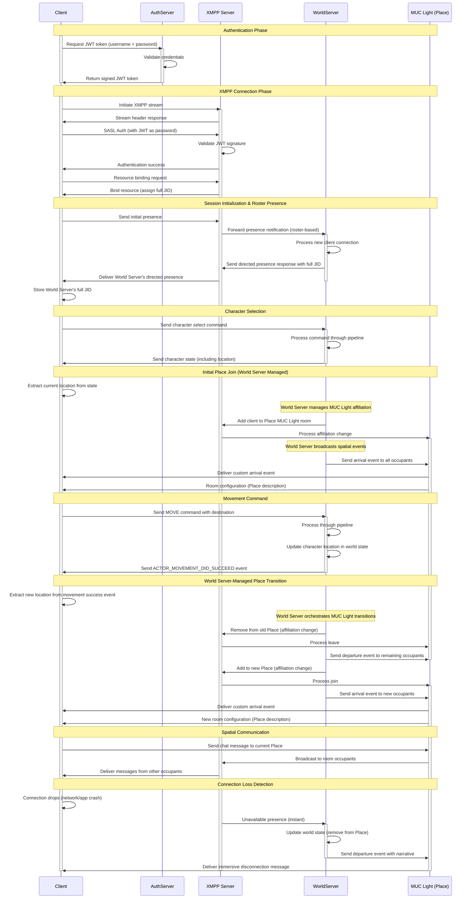
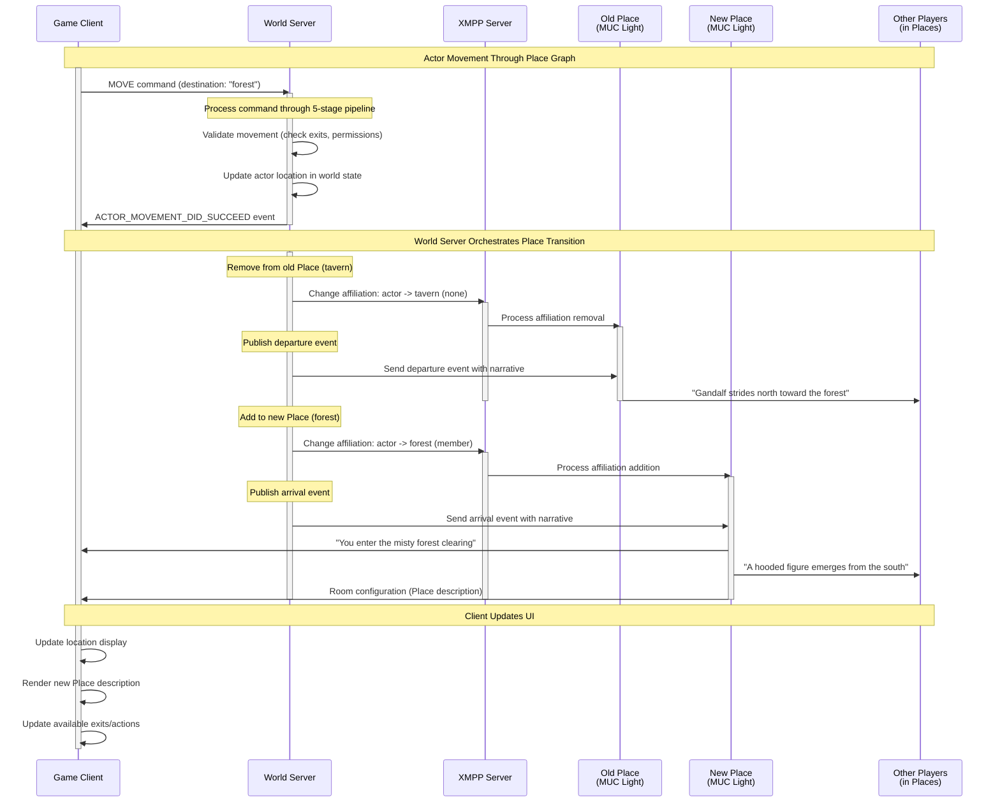
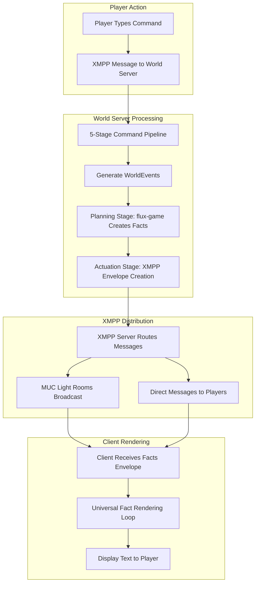

# XMPP Technical Design: Spatial Simulation Protocol

## Executive Summary

This document outlines how our MUD architecture leverages XMPP (Extensible Messaging and Presence Protocol) as a **spatial simulation protocol** using **MUC Light** for presenceless, World Server-managed spatial events. XMPP serves as the communication backbone that enables real-time spatial awareness, secure multiplayer interactions, and emergent gameplay through a centrally-controlled but distributively-experienced world simulation.

## Core Architectural Principles

### 1. World Server as Single Authority

**Fundamental Constraint**: To enact any state change on the world, all actors **must** send an Intent/Command to the World Server. No exceptions.

- **Players cannot directly join/leave MUC Light rooms** - World Server orchestrates all affiliation changes
- **Players cannot send messages to MUC Light rooms** - World Server controls all narrative
- **Players cannot modify rosters** - World Server manages all relationships

### 2. MUC Light as Spatial Simulation Framework

XMPP MUC Light rooms represent **Places** in the game world:
- Each Place has a corresponding MUC Light room (e.g., `tavern@places.fabric.flux.io`)
- Player movement between Places = MUC Light affiliation changes
- **Presenceless design** - no presence noise, only meaningful spatial events
- Room configuration = Place descriptions and metadata
- Room occupancy = spatial co-location managed via affiliations

### 3. Roster-Based Presence Monitoring

- **World Server on every actor's roster** for instant connection detection
- **One-directional presence flow**: Actor → World Server
- **Instant offline detection** via XMPP's reliable presence semantics
- **No presence exchange in Places** - MUC Light eliminates presence noise

## Custom MongooseIM Module: World Server Presence Notification

### Purpose

To enable instant, reliable detection of player connection and disconnection events, we have implemented a custom MongooseIM extension module, `mod_presence_notify`. This module ensures that the World Server is notified of all presence changes for every actor, regardless of roster state or subscription, providing a robust foundation for authoritative world state management.

### How It Works

- **Server-Side Hook:** The module hooks into MongooseIM's internal presence change events (`user_presence_changed`).
- **Unconditional Notification:** Whenever any user's presence changes (e.g., available, unavailable), the module constructs a custom XMPP `<message>` stanza and routes it directly to the World Server user (e.g., `server@fabric.flux.local`).
- **No Roster Dependency:** This notification is unconditional and does **not** depend on roster subscriptions or mutual presence. The World Server receives presence updates for all actors, regardless of their roster state.
- **Structured Payload:** The notification message includes a custom XML child with a JSON payload, namespaced for easy parsing:

```xml
<message from="bob@fabric.flux.local" to="server@fabric.flux.local" type="chat">
  <body>Presence update</body>
  <event xmlns="flux:xmpp" mime="application/json">
    <![CDATA[
    {
      "trace": "dcf6924a-b0a0-4d50-b685-e37797afa416",
      "type": "XMPP_USER_PRESENCE_DID_CHANGE",
      "args": {
        "user": "bob@fabric.flux.local",
        "presence": "available"
      }
    }
    ]]>
  </event>
</message>
```

- **Traceability:** Each event includes a unique trace ID for correlation and debugging.
- **Extensibility:** The event type and arguments are designed for future expansion (e.g., additional presence states, metadata).

### Architectural Fit

- **Single Source of Truth:** The World Server receives all presence events directly from the XMPP server, ensuring it is always aware of player connectivity.
- **No Client Workarounds:** Clients do not need to manage or subscribe to presence; the server handles all detection and notification.
- **Security:** Only the World Server receives these notifications, and only the server can act on them, maintaining strict authority over world state.
- **Performance:** This approach avoids presence storms and unnecessary traffic, as only the World Server is notified, and only meaningful presence changes are sent.

### Implementation Notes

- The module is written in Erlang and integrated directly into the MongooseIM codebase.
- It is configured via the MongooseIM TOML config, specifying the World Server user JID.
- The module is fully unit tested and runs in a containerized environment for reliability.

## System Architecture

### Component Overview

```
┌─────────────────┐    ┌─────────────────┐    ┌─────────────────┐
│   Game Client   │    │  World Server   │    │ MongooseIM XMPP │
│                 │    │                 │    │     Server      │
│ • Player Input  │◄──►│ • Command Proc. │◄──►│ • MUC Light     │
│ • Event Display │    │ • State Mgmt    │    │ • Roster Pres.  │
│ • XMPP Client   │    │ • XMPP Proxy    │    │ • Message Route │
└─────────────────┘    └─────────────────┘    └─────────────────┘
         ▲                       ▲                       ▲
         │                       │                       │
         └───── MUC Light Events & Roster Presence ──────┘
```

### World Server as XMPP Proxy

The World Server acts as an **XMPP proxy** for all player spatial actions:

1. **Receives player commands** via XMPP messages or HTTP
2. **Processes commands** through the 5-stage pipeline
3. **Orchestrates MUC Light operations** on behalf of players
4. **Publishes spatial events** to relevant MUC Light rooms
5. **Notifies players** of command results

## Complete System Flow

### Authentication and Session Initialization



## Movement Command Implementation

### Command Pipeline Integration

```typescript
// Transformation Stage (Pure) - Declares domain events
export const MoveCommandReducer: Transformer<CommandType.MOVE, MoveCommandArgs> = (context, command) => {
  const { to } = command.args;
  const oldLocation = context.actor.location;
  const newLocation = validateMovement(context.actor, to);

  if (newLocation && newLocation !== oldLocation) {
    // Update world state (pure)
    context.actor.location = newLocation;

    // Extract movement context for narrative generation
    const movementContext = extractMovementContext(context.actor);
    const direction = getDirectionBetween(oldLocation, newLocation);

    // Declare spatial domain events using proper EmergentEvent structure
    context.declareEvent({
      type: EventType.ACTOR_DEPARTED,
      payload: {
        actorId: context.actor.urn,
        placeId: oldLocation,
        direction: direction,
        destinationPlaceId: newLocation,
        method: movementContext.method,
        stealth: movementContext.stealth,
        mood: movementContext.mood
      }
    });

    context.declareEvent({
      type: EventType.ACTOR_ARRIVED,
      payload: {
        actorId: context.actor.urn,
        placeId: newLocation,
        direction: getOppositeDirection(direction),
        originPlaceId: oldLocation,
        method: movementContext.method,
        stealth: movementContext.stealth,
        mood: movementContext.mood
      }
    });
  }

  return context;
};

// Planning Stage (Pure but Side Effect-Aware) - Enriches events and plans effects
export const MovementPlanner: PlanningReducer<Command> = (context, command) => {
  // Process declared events and plan corresponding side effects
  context.getDeclaredEvents('actor:*').forEach(event => {
    if (event.type === EventType.ACTOR_DEPARTED) {
      // Plan MUC Light affiliation removal
      context.declareSideEffect({
        type: 'CHANGE_MUC_AFFILIATION',
        jid: event.payload.actorId,
        roomJid: getMucLightJid(event.payload.placeId),
        affiliation: 'none'
      });

      // Plan enriched spatial event broadcast to departure room
      context.declareSideEffect({
        type: 'BROADCAST_ENRICHED_EVENT',
        roomJid: getMucLightJid(event.payload.placeId),
        event: event // Will be enriched with subjective/objective narratives
      });
    }

    if (event.type === EventType.ACTOR_ARRIVED) {
      // Plan MUC Light affiliation addition
      context.declareSideEffect({
        type: 'CHANGE_MUC_AFFILIATION',
        jid: event.payload.actorId,
        roomJid: getMucLightJid(event.payload.placeId),
        affiliation: 'member'
      });

      // Plan enriched spatial event broadcast to arrival room
      context.declareSideEffect({
        type: 'BROADCAST_ENRICHED_EVENT',
        roomJid: getMucLightJid(event.payload.placeId),
        event: event // Will be enriched with subjective/objective narratives
      });
    }
  });

  return context;
};

/**
 * Extract movement context from actor state for narrative generation
 */
function extractMovementContext(actor: Actor): MovementContext {
  return {
    method: detectMovementMethod(actor),    // walking, running, sneaking, etc.
    stealth: actor.isInStealthMode(),
    mood: actor.currentMood || "neutral"
  };
}
```

## Rich Spatial Events

### World Server Event Broadcasting

The World Server publishes rich spatial events to MUC Light rooms:

#### Actor Arrival
```xml
<message from="flux.sys.server@fabric.flux.local"
         to="flux.place.tavern@places.flux.local"
         type="groupchat">
  <body>Movement event</body>
  <event xmlns="flux:world" mime="application/json" schema-version="1.0">
    <![CDATA[
    {
      "id": "cmd_123",
      "ts": 1705324200000,
      "trace": "dcf6924a-b0a0-4d50-b685-e37797afa416",
      "type": "ACTOR_ARRIVED",
      "payload": {
        "actorId": "flux:actor:gandalf",
        "placeId": "flux:place:tavern",
        "direction": "north",
        "originPlaceId": "flux:place:road",
        "method": "walking",
        "stealth": false,
        "mood": "determined"
      },
      "spatial": {
        "from": {
          "id": "flux:place:road",
          "name": "North Road"
        },
        "to": {
          "id": "flux:place:tavern",
          "name": "The Prancing Pony"
        },
        "direction": "north"
      },
      "subjective": "You stride into the tavern from the north, your steps purposeful and determined.",
      "objective": "Gandalf strides into the tavern from the north, his robes billowing behind him."
    }
    ]]>
  </event>
</message>
```

#### Actor Departure
```xml
<message from="flux.sys.server@fabric.flux.local"
         to="flux.place.tavern@places.flux.local"
         type="groupchat">
  <body>Movement event</body>
  <event xmlns="flux:world" mime="application/json" schema-version="1.0">
    <![CDATA[
    {
      "id": "cmd_124",
      "ts": 1705324250000,
      "trace": "dcf6924a-b0a0-4d50-b685-e37797afa416",
      "type": "ACTOR_DEPARTED",
      "payload": {
        "actorId": "flux:actor:gandalf",
        "placeId": "flux:place:tavern",
        "direction": "south",
        "destinationPlaceId": "flux:place:forest",
        "method": "walking",
        "stealth": false,
        "mood": "urgent"
      },
      "spatial": {
        "from": {
          "id": "flux:place:tavern",
          "name": "The Prancing Pony"
        },
        "to": {
          "id": "flux:place:forest",
          "name": "Whispering Forest"
        },
        "direction": "south"
      },
      "subjective": "You stride purposefully toward the forest, leaving the warmth of the tavern behind.",
      "objective": "Gandalf strides purposefully toward the south, his urgent manner unmistakable."
    }
    ]]>
  </event>
</message>
```

#### Environmental Changes
```xml
<message from='places.example.com/forest' to='player1@example.com' type='groupchat'>
  <body>The fog begins to lift as dawn approaches.</body>
  <x xmlns='custom:world-events'>
    <environment-change type='weather' from='foggy' to='clear'/>
    <visibility-change from='limited' to='normal'/>
  </x>
</message>
```

#### Connection Loss (Graceful Narrative)
```xml
<message from='places.example.com/tavern' to='player1@example.com' type='groupchat'>
  <body>Gandalf suddenly vanishes in a puff of smoke, muttering about urgent business.</body>
  <x xmlns='custom:world-events'>
    <actor-departed jid='gandalf@example.com' reason='connection-lost'/>
  </x>
</message>
```

### Event Types

The World Server publishes rich spatial domain events with universal narrative enrichment:

#### Movement Events
- **`ACTOR_ARRIVED`**: Actor enters a new place with spatial context
- **`ACTOR_DEPARTED`**: Actor leaves a place with destination information
- **`ACTOR_MATERIALIZED`**: Actor connects/spawns into world
- **`ACTOR_DEMATERIALIZED`**: Actor disconnects/despawns from world

#### Social Events
- **`SOCIAL_EMOTE`**: Gestures, expressions, social interactions
- **`SOCIAL_SPEECH`**: Speaking, whispering, shouting
- **`SOCIAL_ACTION`**: Custom social commands

#### Combat Events
- **`COMBAT_ATTACK`**: Physical attacks, spell casting
- **`COMBAT_DEFEND`**: Blocking, dodging, parrying
- **`COMBAT_EFFECT`**: Damage, healing, status changes

#### Environmental Events
- **`WEATHER_CHANGE`**: Rain starts, fog lifts, etc.
- **`LIGHTING_CHANGE`**: Day/night transitions, magical illumination
- **`ATMOSPHERIC_EVENT`**: Sounds, smells, ambient changes

#### Economic Events
- **`TRADE_INITIATED`**: Player-to-player trading
- **`ITEM_TRANSFER`**: Giving, dropping, picking up items
- **`SHOP_INTERACTION`**: Buying, selling at merchants

All events include pre-rendered subjective and objective narratives for immediate client display.

## MUC Light Configuration

### MongooseIM Configuration

```toml
[modules.mod_muc_light]
  host = "places.@HOST@"
  backend = "rdbms"
  blocking = false                 # DISABLED - maintains World Server spatial authority
  equal_occupants = false          # Maintains owner hierarchy
  all_can_configure = false        # Only owners can configure
  all_can_invite = false           # Only owners can invite
  max_occupants = 1000             # Application-controlled via World Server
```

### Key MUC Light Benefits

1. **Presenceless Design** - No presence noise in Places
2. **Affiliation-Based Membership** - Perfect for World Server control
3. **Mobile-Optimized** - Efficient for unstable connections
4. **Distributed Broadcasting** - Linear scaling, no bottlenecks
5. **Version-Based Synchronization** - Efficient state updates

## Security Model

### Threat Prevention

1. **Script Kiddie Protection**: Players cannot send crafted XMPP stanzas to other players
2. **Command Injection Prevention**: All player input flows through command validation pipeline
3. **State Manipulation Prevention**: Only World Server can modify world state
4. **Communication Control**: Only World Server can broadcast to MUC Light rooms
5. **Information Disclosure Prevention**: Players cannot discover occupied rooms via disco#items queries
6. **Blocking Interference Prevention**: MUC Light blocking disabled to maintain spatial authority

### Access Control Matrix

| Actor Type | MUC Light Join | MUC Message | MUC Create | Roster Modify | Disco Items | Blocking |
|------------|----------------|-------------|------------|---------------|-------------|----------|
| Player     | ❌ (via WS)    | ❌          | ❌         | ❌            | ❌          | ❌       |
| World Server | ✅           | ✅          | ✅         | ✅            | ✅          | ✅       |
| Admin      | ✅             | ✅          | ✅         | ✅            | ✅          | ✅       |

## Performance Characteristics

### MUC Light Optimization

- **Presenceless Operation**: Zero presence traffic, only meaningful spatial events
- **Affiliation Management**: Efficient membership changes without presence floods
- **Room Versioning**: Clients only receive state changes, not full state
- **Distributed Broadcasting**: Messages broadcast from sender context, no bottlenecks

### Scaling Properties

- **Linear MUC Light Broadcasting**: Message delivery scales O(n) with room occupants
- **No Presence Storms**: MUC Light eliminates quadratic presence scaling issues
- **Efficient State Sync**: Version-based updates reduce unnecessary traffic
- **Horizontal Scaling**: Multiple World Server instances can share XMPP load

### Performance Comparison

| Scenario | Traditional MUC | MUC Light |
|----------|----------------|-----------|
| 50 people in tavern | 50 presence updates per join/leave | 0 presence updates |
| Player movement | 2x presence floods (leave + join) | 2x affiliation changes (silent) |
| Connection drops | Presence unavailable to all | Silent removal, narrative event |
| Large battles | Presence storms + message floods | Clean spatial events only |

## Architecture Benefits

### 🎯 **Narrative Control**
- Rich, contextual spatial events instead of dry presence notifications
- Immersive arrival/departure descriptions with game context
- Game mechanics integration (stealth, perception, environmental factors)

### ⚡ **Performance & Reliability**
- No presence noise in Places (MUC Light presenceless design)
- Instant connection detection (XMPP roster-based presence)
- Batched spatial updates and selective event broadcasting
- Mobile-optimized for unstable connections

### 🎮 **Gameplay Advantages**
- Information becomes a strategic resource (stealth, perception)
- Environmental factors affect spatial awareness
- Consistent spatial event flow through World Server authority
- Easy to extend with new event types and mechanics

### 🔒 **Security & Control**
- World Server maintains complete spatial authority
- No player blocking interference (disabled in MUC Light)
- All spatial changes flow through validated game logic
- ACL-enforced communication restrictions

## Alternative Architectures Considered

### Traditional MUC

**Considered**: Using traditional MUC rooms for Places.

**Rejected**: Presence storms would create quadratic scaling issues and generate massive amounts of non-meaningful traffic. The IRC-like model doesn't fit spatial simulation needs.

### PubSub Topics

**Considered**: Using PubSub topics instead of MUC Light rooms for Places.

**Rejected**: Would lose bidirectional occupancy awareness and real-time join/leave notifications critical for spatial simulation UX.

### Custom Protocol

**Considered**: Building custom spatial awareness protocol.

**Rejected**: XMPP MUC Light provides battle-tested room semantics, efficient broadcasting, and rich extensibility through custom namespaces while eliminating presence overhead.

## Implementation Roadmap

### Phase 1: Core MUC Light Integration ✅
- [x] MUC Light room creation/management via World Server
- [x] Basic player movement via MUC Light affiliation changes
- [x] World Server message broadcasting to rooms
- [x] Blocking functionality disabled

### Phase 2: Rich Spatial Events
- [ ] Custom spatial event extensions for character metadata
- [ ] Direction-aware movement notifications
- [ ] Environmental state in room configuration

### Phase 3: Advanced Events
- [ ] Combat event broadcasting
- [ ] Social interaction events
- [ ] Environmental/weather events

### Phase 4: Optimization
- [ ] Room lifecycle management (auto-create/destroy)
- [ ] Message archiving and replay via MAM
- [ ] Load balancing across multiple XMPP connections

## Monitoring and Observability

### Key Metrics

- **MUC Light Operations/sec**: Affiliation change frequency per room
- **Message Broadcast Latency**: Time from World Server publish to client delivery
- **Spatial Event Frequency**: Real-time spatial awareness responsiveness
- **Room Occupancy Distribution**: Load balancing across Places

### Error Handling

- **MUC Light Affiliation Failures**: Retry with exponential backoff
- **Message Delivery Failures**: Dead letter queue for critical spatial events
- **Occupancy Desync**: Periodic reconciliation of actual vs. expected occupancy

## Conclusion

XMPP with **MUC Light** serves as the **perfect spatial simulation protocol** for our MUD architecture. By leveraging MUC Light's presenceless design with World Server-managed spatial events, we achieve:

1. **Real-time spatial awareness** without presence noise through efficient affiliation management
2. **Bulletproof security** through ACL-enforced communication control and disabled blocking
3. **Rich emergent interactions** through custom spatial event broadcasting
4. **Superior performance** through presenceless design and linear scaling
5. **Mobile optimization** through MUC Light's connection-resilient architecture

This design transforms XMPP from a simple chat protocol into a sophisticated **presenceless spatial simulation framework** that enables truly emergent multiplayer experiences while maintaining complete security, performance, and narrative control guarantees.

The combination of MUC Light's mobile-optimized, presenceless design with our World Server's spatial authority creates an architecturally brilliant foundation for immersive, scalable spatial simulation.


## Actor Movement



## Information Propagation

### 1. **XMPP as Spatial Simulation Protocol**

Your system uses XMPP with **MUC Light** as the communication backbone:

```
World Server (Authority) → XMPP Server → MUC Light Rooms (Places) → Game Clients
```

**Key Design Principles:**
- **World Server Authority**: Players can't directly interact with MUC Light rooms - all spatial events must flow through the World Server
- **Presenceless Design**: MUC Light eliminates presence noise, only meaningful spatial events are transmitted
- **Room = Place**: Each game location has a corresponding MUC Light room (e.g., `tavern@places.fabric.flux.io`)

### 2. **Universal Facts System**

All game information is delivered as **Facts** - discrete pieces of knowable information:

```typescript
// Everything is a Fact
- Static Facts: "The room contains a sword"
- Temporal Facts: "The door opened at 15:32:01"
- Interrogative Facts: "You see a vast hall"
- Relational Facts: "The sword belongs to Alice"
```

### 3. **Complete Information Flow**

Here's how information propagates from server to client:



### 4. **Facts Envelope Structure**

Information arrives at your client in batched XMPP envelopes:

```xml
<message to="player@example.com" type="chat">
  <facts xmlns="flux:world" trace="cmd_dcf6924a-b0a0-4d50-b685-e37797afa416">
    <![CDATA[
    [
      {
        "kind": "view",
        "subject": {
          "id": "flux:place:tavern",
          "name": "The Prancing Pony",
          "description": "A cozy tavern...",
          "exits": { "north": "flux:place:street" },
          "occupants": ["flux:actor:gandalf"]
        },
        "text": "A cozy tavern with wooden tables and flickering candles."
      },
      {
        "kind": "event",
        "subject": {
          "type": "ACTOR_DID_MOVE",
          "actor": "flux:actor:gandalf",
          "payload": { "destination": "flux:place:forest" }
        },
        "text": {
          "actor": "You walk north into the forest",
          "observer": "Gandalf walks north into the forest"
        }
      }
    ]
    ]]>
  </facts>
</message>
```

### 5. **Client-Side Processing**

Your client has incredibly simple processing logic:

```typescript
// This is all the client needs!
xmpp.on('message', (message) => {
  const factsElement = message.getChild('facts');
  if (factsElement) {
    const facts: Fact[] = JSON.parse(factsElement.text());

    facts.forEach(fact => {
      let displayText: string;

      if (typeof fact.text === 'string') {
        displayText = fact.text;
      } else {
        // Perspective-aware text
        displayText = isMyActor(fact.subject?.actor)
          ? fact.text.actor
          : fact.text.observer;
      }

      terminal.writeLine(displayText);
    });
  }
});
```


## XMPP PubSub Consumer Workflow

### Overview

This section documents the **generalized workflow** for any system that needs to consume world events published via XMPP PubSub. Whether building simulation engines, monitoring systems, analytics pipelines, or game clients, this pattern provides a robust foundation for real-time world event consumption.

The workflow transforms external XMPP PubSub events into structured `WorldEvent` payloads that can be processed by any consuming system. This architecture enables **distributed world state awareness** across multiple systems and services.

### Consumer Architecture Pattern

**Universal Problem**: External systems need to react to world events (weather changes, actor movements, resource updates) in real-time without direct coupling to the World Server.

**XMPP PubSub Solution**: A **publish-subscribe pattern** where the World Server publishes events to well-known topics, and any number of consumers can subscribe to receive relevant events.

**Key Benefits**:
- **Decoupled Architecture**: Consumers don't need direct connections to the World Server
- **Selective Consumption**: Subscribe only to relevant event types
- **Horizontal Scaling**: Multiple consumer instances can process events independently
- **Resilient Delivery**: XMPP's reliable message delivery ensures event consistency

### Consumer Implementation Patterns

#### Pure & Deterministic Consumer Design

Any robust world event consumer should follow **pure and deterministic** design principles with explicit dependency injection. This pattern ensures testability, reliability, and predictable behavior across different environments.

**Reference Implementation Pattern:**
```typescript
// Define impurities for any consumer
export type ConsumerImpurities = {
  setTimeout: typeof setTimeout;
  clearTimeout: typeof clearTimeout;
  log: Logger;
}

// Generic consumer interface
export const createWorldEventConsumer = async (
  xmppClient: XmppClient,
  config: PubSubConfig,
  eventHandler: (event: WorldEvent) => void,
  impurities: ConsumerImpurities
): Promise<() => Promise<void>> => {
  // Consumer implementation with injected dependencies
};
```

### Consumer Types and Use Cases

#### 1. **Simulation Engine Consumers**
- **Purpose**: Feed external events into simulation state
- **Topics**: Weather, resources, environmental changes
- **Processing**: Transform events into simulation commands

#### 2. **Analytics and Monitoring Consumers**
- **Purpose**: Track world state changes for metrics and insights
- **Topics**: All event types for comprehensive monitoring
- **Processing**: Extract metrics, generate alerts, update dashboards

#### 3. **Game Client Consumers**
- **Purpose**: Real-time UI updates and player notifications
- **Topics**: Events relevant to player's current location
- **Processing**: Update game UI, trigger animations, show notifications

#### 4. **AI and Bot Consumers**
- **Purpose**: Enable AI systems to react to world changes
- **Topics**: Events in AI's area of influence
- **Processing**: Feed into AI decision-making algorithms

### Core Consumer Workflow Patterns

#### Subscription Lifecycle Management

Any production-ready consumer must implement comprehensive subscription lifecycle management:

##### 1. **Individual Topic Subscription Pattern**
```typescript
async function subscribeToTopic(
  xmppClient: XmppClient,
  pubsubServer: string,
  topicName: string,
  timeoutMs: number,
  dependencies: ConsumerImpurities,
): Promise<void>
```

**Essential Features for Any Consumer**:
- **XMPP IQ Protocol Compliance**: Send proper subscription IQ stanzas per XMPP PubSub RFC
- **Response Handling**: Process subscription success/failure with detailed error context
- **Timeout Management**: Configurable timeouts with cleanup to prevent resource leaks
- **Deterministic Behavior**: Use injected dependencies for predictable testing

##### 2. **Batch Subscription with Resilience**
```typescript
async function subscribeToTopics(
  xmppClient: XmppClient,
  consumerConfig: ConsumerConfig,
  dependencies: ConsumerImpurities,
): Promise<void>
```

**Production-Ready Features**:
- **Retry Strategy**: Configurable retry attempts with exponential backoff
- **Failure Isolation**: Individual topic failures don't prevent other subscriptions
- **Progress Tracking**: Comprehensive logging for operational visibility
- **Partial Success Handling**: Continue operation even if some subscriptions fail

##### 3. **Connection State Management Pattern**

**Essential Reconnection Handling**:
```typescript
xmppClient.on('online', async () => {
  log.info('Consumer reconnected - resubscribing to topics');

  try {
    await subscribeToTopics(xmppClient, config, dependencies);
    log.info('Successfully resubscribed to all topics after reconnection');
  } catch (error) {
    log.error({ error }, 'Failed to resubscribe after reconnection');
    // Emit error event for application-level handling
    emitConsumerError('reconnection_failed', error);
  }
});
```

**Critical Connection Patterns**:
- **Resilient Reconnection**: Automatically resubscribe when XMPP connection is restored
- **Graceful Degradation**: Subscription failures don't crash the consumer entirely
- **State Tracking**: Distinguish between initial connection and reconnection scenarios
- **Error Propagation**: Notify application of connection-related failures

##### 4. **Resource Cleanup Pattern**
```typescript
async function cleanupConsumer(
  xmppClient: XmppClient,
  consumerConfig: ConsumerConfig,
  dependencies: ConsumerImpurities,
): Promise<void>
```

**Essential Cleanup Features**:
- **Graceful Shutdown**: Unsubscribe from all topics before termination
- **Parallel Cleanup**: Use `Promise.allSettled` to ensure all cleanup attempts complete
- **Error Resilience**: Log cleanup failures but complete shutdown regardless
- **Resource Safety**: Prevent memory leaks and connection artifacts

#### Consumer Configuration Patterns

##### Well-Known Topic Discovery
```typescript
// Standard world event topics that consumers can subscribe to
export enum WorldEventTopic {
  ANNOUNCEMENTS = 'announcements',  // System announcements
  WEATHER = 'weather',              // Environmental changes
  RESOURCES = 'resources',          // Resource state updates
  COMBAT = 'combat',                // Combat and conflict events
  SOCIAL = 'social',                // Social interactions
  ECONOMY = 'economy',              // Trade and economic events
}
```

##### Environment-Based Consumer Configuration
```typescript
interface ConsumerConfig {
  pubsubServer: string;           // XMPP PubSub service endpoint
  topics: string[];               // Topics this consumer cares about
  retryAttempts?: number;         // Subscription retry attempts
  retryDelay?: number;            // Delay between retries (ms)
  subscriptionTimeout?: number;   // Subscription timeout (ms)
  consumerName: string;           // Unique consumer identifier
}

function createConsumerConfig(
  consumerName: string,
  interestedTopics: WorldEventTopic[]
): ConsumerConfig {
  const { XMPP_DOMAIN = 'fabric.flux.local' } = process.env;
  const PUBSUB_SERVICE_DOMAIN = `topics.${XMPP_DOMAIN}`;

  return {
    pubsubServer: PUBSUB_SERVICE_DOMAIN,
    topics: interestedTopics,
    retryAttempts: 3,
    retryDelay: 5000,
    subscriptionTimeout: 10000,
    consumerName,
  };
}
```

#### Universal Event Processing Pipeline

Any world event consumer should implement a robust event processing pipeline:

##### 1. **XMPP Stanza Parsing**
```typescript
function parseWorldEventMessage(
  xmppMessage: Element,
  logger: Logger
): RawWorldEventPayload | null
```

**Essential Parsing Features**:
- **XMPP Stanza Validation**: Verify proper PubSub event structure per RFC
- **Namespace Enforcement**: Only process messages from `flux:world` namespace
- **MIME Type Checking**: Ensure `application/json` content type
- **Graceful Error Handling**: Log parsing failures without crashing consumer

##### 2. **Event Validation and Transformation**
```typescript
function validateAndTransformEvent(
  rawPayload: RawWorldEventPayload,
  logger: Logger
): WorldEvent | null
```

**Critical Validation Steps**:
- **Event Type Dispatch**: Route different event types to appropriate handlers
- **Required Field Validation**: Ensure all mandatory fields are present and valid
- **Data Type Conversion**: Transform raw data into strongly-typed domain objects
- **Business Rule Validation**: Apply consumer-specific validation logic

##### 3. **Consumer-Specific Processing**
```typescript
// Example: Simulation Engine Consumer
async function processWorldEvent(
  worldEvent: WorldEvent,
  simulationEngine: SimulationEngine
): Promise<void> {
  switch (worldEvent.type) {
    case 'WEATHER_DID_CHANGE':
      await simulationEngine.updateWeatherState(worldEvent);
      break;
    case 'ACTOR_DID_MOVE':
      await simulationEngine.processActorMovement(worldEvent);
      break;
    // Handle other event types...
  }
}

// Example: Analytics Consumer
async function processWorldEvent(
  worldEvent: WorldEvent,
  metricsCollector: MetricsCollector
): Promise<void> {
  // Extract metrics from event
  metricsCollector.recordEvent(worldEvent.type, worldEvent.payload);

  // Update dashboards
  await metricsCollector.updateRealTimeDashboard(worldEvent);
}
```

**Processing Patterns**:
- **Event Enrichment**: Add consumer-specific metadata (timestamps, IDs, context)
- **Trace Preservation**: Maintain event correlation through processing pipeline
- **Error Isolation**: Handle individual event failures without stopping consumption
- **Async Processing**: Use proper async patterns for I/O operations

### XMPP Protocol Specification

#### Standard Subscription Stanza Format

All consumers must send properly formatted XMPP PubSub subscription requests:

```xml
<iq type='set' to='topics.fabric.flux.local' id='consumer_unique_request_id'>
  <pubsub xmlns='http://jabber.org/protocol/pubsub'>
    <subscribe node='weather' jid='consumer@fabric.flux.local'/>
  </pubsub>
</iq>
```

**Required Elements**:
- **`type='set'`**: Indicates subscription modification request
- **`to`**: PubSub service JID (environment-specific)
- **`id`**: Unique request ID for response correlation
- **`node`**: Specific topic/channel to subscribe to
- **`jid`**: Consumer's full JID for event delivery

#### Standard World Event Message Format

Consumers will receive events in this standardized XMPP PubSub format:

```xml
<message type='headline' from='topics.fabric.flux.local'>
  <event xmlns='http://jabber.org/protocol/pubsub#event'>
    <items node='weather'>
      <item>
        <event xmlns='flux:world' mime='application/json'>
          <![CDATA[
          {
            "trace": "dcf6924a-b0a0-4d50-b685-e37797afa416",
            "type": "WEATHER_DID_CHANGE",
            "location": "flux:place:tavern",
            "actor": "flux:actor:weathermage",
            "payload": {
              "from": "sunny",
              "to": "rainy",
              "intensity": "moderate"
            },
            "ts": 1705324200000
          }
          ]]>
        </event>
      </item>
    </items>
  </event>
</message>
```

**Standard Payload Structure**:
- **`trace`**: Unique event correlation ID for distributed tracing
- **`type`**: Event type from standardized `WorldEventType` enum
- **`location`**: Place URN where event occurred
- **`actor`**: Optional actor URN who triggered the event
- **`payload`**: Event-specific data (varies by type)
- **`ts`**: Unix timestamp (optional, defaults to receive time)

### Consumer Testing Best Practices

#### Isolation and Deterministic Testing Patterns

Any production consumer should implement **zero side effects testing**:

```typescript
// Mock all impurities for deterministic test execution
interface TestMocks {
  setTimeout: MockFunction;
  clearTimeout: MockFunction;
  log: MockLogger;
  xmppClient: MockXmppClient;
}

function createTestMocks(): TestMocks {
  return {
    setTimeout: vi.fn(),
    clearTimeout: vi.fn(),
    log: createMockLogger(),
    xmppClient: createMockXmppClient(),
  };
}

// Smart timeout mocking for different scenarios
mocks.setTimeout.mockImplementation((callback: Function, delay: number) => {
  const timeoutId = Math.random();

  // Handle different timeout types appropriately
  if (delay <= RETRY_DELAY_THRESHOLD) {
    // Retry delays - execute immediately to avoid slow tests
    setImmediate(callback);
  } else {
    // Subscription timeouts - store but don't execute (prevent timeouts)
    mocks.setTimeout._callbacks.set(timeoutId, { callback, delay });
  }

  return timeoutId;
});
```

#### Essential Test Scenarios for Any Consumer

**1. Subscription Lifecycle**
- Initial subscription success/failure scenarios
- Retry logic verification with controlled failures
- Timeout handling without real delays
- Batch subscription with partial failures

**2. Connection Resilience**
- Reconnection handling and resubscription
- Connection state changes during active consumption
- Graceful degradation when resubscription fails

**3. Message Processing**
- Valid world event parsing and transformation
- Malformed XMPP stanza handling
- Invalid JSON payload processing
- Missing required field validation

**4. Resource Management**
- Proper cleanup on consumer shutdown
- Unsubscription success/failure scenarios
- Memory leak prevention verification
- Event listener cleanup validation

**5. Error Isolation**
- Individual event processing failures don't stop consumption
- Subscription errors don't crash the consumer
- Logging failures don't interrupt operation

#### Performance Testing Goals

**Target Metrics for Consumer Tests**:
- **Sub-second execution**: All tests complete in < 1000ms
- **Zero real I/O**: No actual XMPP connections or timeouts
- **Complete coverage**: 100% of subscription/processing scenarios
- **Deterministic results**: Tests pass/fail consistently across environments

### Consumer Integration Patterns

#### Universal Event Flow

The generalized consumer workflow fits into any system architecture:

```
World Server → XMPP PubSub → Consumer → Application Processing → Domain-Specific Actions
```

**Integration Examples**:
- **Simulation Engine**: `WorldEvent → SimulationCommand → StateUpdate`
- **Analytics System**: `WorldEvent → MetricExtraction → DashboardUpdate`
- **Game Client**: `WorldEvent → UIUpdate → PlayerNotification`
- **AI System**: `WorldEvent → ContextUpdate → DecisionMaking`

#### Environment and Configuration Integration

**Standard Environment Variables**:
```bash
XMPP_DOMAIN=fabric.flux.local          # Base domain for service discovery
CONSUMER_NAME=simulation-engine         # Unique consumer identifier
CONSUMER_TOPICS=weather,resources        # Comma-separated topic list
PUBSUB_RETRY_ATTEMPTS=3                 # Subscription retry count
PUBSUB_RETRY_DELAY=5000                 # Retry delay in milliseconds
```

**Application Integration Points**:
- **XMPP Client Pool**: Reuse shared XMPP connections when possible
- **Event Bus**: Integrate with application's event processing system
- **Logging**: Use application's structured logging framework
- **Metrics**: Emit consumer metrics to application monitoring system

#### Error Handling and Observability Patterns

**Structured Error Events**:
```typescript
interface ConsumerError {
  consumerName: string;        // Unique consumer identifier
  errorType: string;           // subscription_failed, parsing_error, etc.
  phase: string;               // initialization, processing, cleanup
  error: Error;                // Original error object
  context: Record<string, any>; // Additional context
}
```

**Monitoring Integration**:
- **Health Checks**: Expose consumer health via application health endpoints
- **Metrics Emission**: Report subscription status, event processing rates
- **Trace Correlation**: Maintain distributed tracing through event processing
- **Alert Integration**: Notify operations teams of critical failures

### Operational Excellence for Consumers

#### Essential Resilience Features

Any production consumer should implement these operational patterns:

**Connection Resilience**:
- **Automatic Reconnection**: Handle XMPP connection drops transparently
- **Backoff Strategy**: Exponential backoff for subscription retries
- **Graceful Degradation**: Continue operation despite partial subscription failures
- **Resource Safety**: Proper cleanup prevents memory leaks and zombie connections

**Processing Resilience**:
- **Event Isolation**: Individual event failures don't stop consumption
- **Circuit Breaker**: Pause processing under sustained failure conditions
- **Dead Letter Queue**: Handle persistently problematic events
- **Rate Limiting**: Protect downstream systems from event floods

#### Monitoring and Observability Standards

**Essential Metrics for Any Consumer**:
```typescript
interface ConsumerMetrics {
  subscriptionsActive: number;      // Currently active subscriptions
  eventsReceived: number;          // Total events received
  eventsProcessed: number;         // Successfully processed events
  eventsFailed: number;            // Failed event processing attempts
  reconnectionCount: number;       // XMPP reconnection frequency
  avgProcessingTime: number;       // Average event processing duration
}
```

**Structured Logging Standards**:
- **Trace Correlation**: Preserve event trace IDs through processing
- **Contextual Information**: Include consumer name, topic, event type
- **Error Classification**: Categorize errors by type and severity
- **Performance Tracking**: Log processing durations and throughput

#### Security and Validation Requirements

**Input Security**:
- **Namespace Validation**: Only accept events from authorized namespaces
- **Schema Validation**: Validate event structure against known schemas
- **Size Limits**: Prevent resource exhaustion from oversized events
- **Rate Limiting**: Protect against malicious event flooding

**Operational Security**:
- **Authentication**: Ensure consumer has valid XMPP credentials
- **Authorization**: Verify subscription permissions for requested topics
- **Audit Trail**: Log all subscription and processing activities
- **Error Sanitization**: Prevent sensitive data leakage in error messages

### Future Evolution Patterns

#### Extensibility Patterns for Consumer Evolution

**Dynamic Configuration**:
- **Runtime Topic Management**: Add/remove subscriptions without restart
- **Adaptive Timeouts**: Adjust timeout values based on network conditions
- **Feature Flags**: Enable/disable processing features dynamically

**Scalability Patterns**:
- **Horizontal Scaling**: Multiple consumer instances with coordination
- **Load Balancing**: Distribute event processing across instances
- **Partitioning**: Divide topics by consumer specialization
- **Caching**: Cache frequently accessed world state for performance

**Advanced Processing**:
- **Event Filtering**: Server-side or consumer-side event filtering
- **Event Transformation**: Sophisticated data transformation pipelines
- **Batch Processing**: Group events for efficient batch processing
- **Stream Processing**: Real-time analytics and event correlation

### Implementation Success Criteria

A successfully implemented world event consumer demonstrates:

✅ **Functional Correctness**: Receives and processes all subscribed events
✅ **Operational Resilience**: Handles failures gracefully without data loss
✅ **Performance**: Sub-second event processing with minimal resource usage
✅ **Testability**: Comprehensive test coverage with zero side effects
✅ **Observability**: Rich metrics and logging for operational visibility
✅ **Security**: Robust input validation and error isolation

This workflow pattern enables any system to become a first-class participant in the distributed world event ecosystem, whether for simulation, analytics, monitoring, or player experience enhancement.
