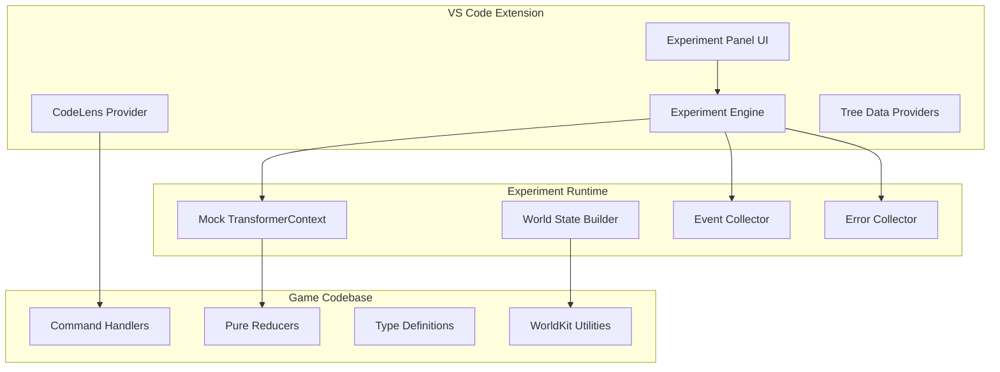

# VS Code Experiment Tool Extension

## Overview

The **Flux Game Logic Experiment Tool** is a VS Code extension that brings interactive game development directly into the editor. By leveraging the pure functional architecture of the game's Transformation stage, the extension provides real-time testing, time-travel debugging, and visual state inspection for game mechanics.

Unlike traditional game development tools that require separate applications or complex setup, this extension integrates seamlessly into the developer's existing workflow, enabling **experiment-driven development** where game mechanics are designed, tested, and debugged interactively.

## User Experience

### Primary Interface: Experiment Panel

The extension adds a dedicated **Experiment Panel** to the VS Code sidebar, providing:

```
┌─ EXPERIMENTS ─────────────────────────┐
│ 🧪 New Experiment                     │
├───────────────────────────────────────┤
│ 📁 Collections                        │
│   ├─ ⚔️ Combat Mechanics             │
│   ├─ 🏃 Movement & Stealth           │
│   ├─ 🏗️ World Building              │
│   └─ 🧬 Resource Systems             │
├───────────────────────────────────────┤
│ ⏮️ Recent Experiments                 │
│   ├─ 🎭 Multi-Step Stealth (v1.2)    │
│   ├─ ⚔️ Combat + Magic (v2.1)        │
│   └─ 🌍 Weather Dynamics (v1.0)      │
├───────────────────────────────────────┤
│ 🔍 Search Experiments...              │
└───────────────────────────────────────┘
```

### Creating Experiments

#### 1. Quick Start from Code

When viewing a command handler file (e.g., `MOVE/handler.ts`), developers can:

```typescript
// Right-click on this reducer function
export const actorMovementReducer: PureReducer<TransformerContext, MoveCommand> = (context, command) => {
  // Game logic here...
};

// Context menu shows:
// "🧪 Create Experiment from MOVE Command"
// "🧪 Add to Existing Experiment"
// "🧪 Generate Test Scenarios"
```

This automatically creates a new experiment with:
- Pre-configured command type (`CommandType.MOVE`)
- Minimal world state template based on command requirements
- Intelligent default assertions based on the reducer's event declarations

#### 2. Visual Experiment Builder

The **Experiment Builder** provides a guided interface:

```
┌─ NEW EXPERIMENT ──────────────────────────────────────┐
│ Name: Multi-Actor Combat Sequence                     │
│ Description: Test complex combat interactions...      │
├────────────────────────────────────────────────────────┤
│ 🌍 INITIAL WORLD STATE                                │
│   ┌─ World Builder ───────────────────────────────────┐│
│   │ Actors:  [+ Add Actor]                           ││
│   │   🧙 wizard    (hp: 100, mana: 50, level: 5)    ││
│   │   ⚔️ warrior   (hp: 120, mana: 10, level: 3)    ││
│   │   🧌 orc       (hp: 80,  mana: 0,  level: 2)    ││
│   │                                                   ││
│   │ Places: [+ Add Place]                            ││
│   │   🏰 castle_courtyard (lighting: bright)         ││
│   │   🌲 forest_edge     (lighting: dim)             ││
│   │                                                   ││
│   │ Items:  [+ Add Item]                             ││
│   │   🗡️ iron_sword     (damage: 15, durability: 90) ││
│   └───────────────────────────────────────────────────┘│
├────────────────────────────────────────────────────────┤
│ ⚡ COMMAND SEQUENCE                                    │
│   ┌─ Command Builder ─────────────────────────────────┐│
│   │ 1. MOVE        wizard → forest_edge              ││
│   │ 2. ATTACK      warrior → orc                     ││
│   │ 3. CAST_SPELL  wizard → fireball (target: orc)   ││
│   │ 4. MOVE        orc → castle_courtyard            ││
│   │                                      [+ Add]     ││
│   └───────────────────────────────────────────────────┘│
├────────────────────────────────────────────────────────┤
│ ✅ ASSERTIONS                                          │
│   □ No actors should die in this sequence             │
│   □ All movement commands should succeed               │
│   □ Spell should declare DAMAGE_APPLIED event         │
│   □ Final orc health < 80                             │
│                                          [+ Add]      │
├────────────────────────────────────────────────────────┤
│           [Cancel]  [Save Draft]  [Run Experiment]    │
└────────────────────────────────────────────────────────┘
```

### Running Experiments

#### Real-Time Execution View

When an experiment runs, the extension opens an **Execution View** tab:

```
┌─ EXPERIMENT: Multi-Actor Combat Sequence ─────────────────────────┐
│ ⏸️ PAUSED at Command 2/4    [◀️] [▶️] [⏭️] [🔄]                   │
├────────────────────────────────────────────────────────────────────┤
│ 📊 CURRENT STATE                                                   │
│   Actors:                                                          │
│     🧙 wizard  (hp: 100/100, mana: 50/50) @ forest_edge          │
│     ⚔️ warrior (hp: 120/120, mana: 10/10) @ castle_courtyard     │
│     🧌 orc     (hp: 65/80,   mana: 0/0)   @ castle_courtyard     │
│                                                                    │
│   Active Effects: warrior has +5 attack bonus                     │
├────────────────────────────────────────────────────────────────────┤
│ ⚡ COMMAND PROGRESSION                                             │
│   ✅ 1. MOVE     wizard → forest_edge        (2ms, 1 event)      │
│   ▶️ 2. ATTACK   warrior → orc               (1ms, 2 events)      │
│   ⏳ 3. CAST_SPELL wizard → fireball                              │
│   ⏳ 4. MOVE     orc → castle_courtyard                           │
├────────────────────────────────────────────────────────────────────┤
│ 📋 DECLARED EVENTS (5 total)                                      │
│   ✅ ACTOR_DID_MOVE          (wizard → forest_edge)               │
│   ✅ DAMAGE_WAS_APPLIED       (warrior dealt 15 damage to orc)    │
│   ✅ COMBAT_ROUND_COMPLETED   (warrior vs orc, round 1)           │
│                                                                    │
│ ⚠️ DECLARED ERRORS (0 total)                                      │
│                                                                    │
│ ✅ ASSERTIONS (2/4 passed)                                        │
│   ✅ All movement commands should succeed                          │
│   ✅ Spell should declare DAMAGE_APPLIED event                    │
│   ⏳ No actors should die in this sequence                        │
│   ⏳ Final orc health < 80                                        │
└────────────────────────────────────────────────────────────────────┘
```

#### Time-Travel Debugging Controls

The execution view provides temporal navigation:

- **⏮️ Step Backward**: Revert to previous command state
- **▶️ Step Forward**: Execute next command
- **⏭️ Skip to End**: Execute remaining commands
- **🔄 Restart**: Reset to initial state
- **⏸️ Pause at Command N**: Set breakpoints on specific commands

#### State Diff Visualization

Hovering over completed commands shows **state diffs**:

```
┌─ STATE DIFF: Command 2 (ATTACK warrior → orc) ────────────┐
│ BEFORE → AFTER                                             │
├────────────────────────────────────────────────────────────┤
│ Actors:                                                    │
│   🧌 orc:                                                  │
│ -   hp: 80          → hp: 65                              │
│ +   effects: []     → effects: [{ type: "combat_damaged"}] │
│                                                            │
│ Events Declared:                                           │
│ + DAMAGE_WAS_APPLIED (15 damage to orc)                   │
│ + COMBAT_ROUND_COMPLETED (round 1)                        │
│                                                            │
│ Execution Time: 1.2ms                                     │
│ Transformers: [AttackTransformer, CombatTransformer]      │
└────────────────────────────────────────────────────────────┘
```

### Code Integration Features

#### 1. Inline Command Testing

While editing command handlers, developers can test them instantly:

```typescript
// In MOVE/handler.ts
export const actorMovementReducer: PureReducer<TransformerContext, MoveCommand> = (context, command) => {
  const { world, declareEvent, declareError } = context;
  // ... reducer logic ...

  declareEvent({
    type: EventType.ACTOR_DID_MOVE,  // ← Hover shows "🧪 Test this event"
    actor: actor.id,
    location: origin.id,
    payload: { destination: destination.id },
    trace: command.id,
  });

  return context;
}; // ← CodeLens shows "🧪 Run Test | 🧪 Create Experiment | 📊 View Coverage"
```

**CodeLens Actions**:
- **🧪 Run Test**: Execute the reducer with default test data
- **🧪 Create Experiment**: Generate experiment template for this command
- **📊 View Coverage**: Show which experiments cover this reducer

#### 2. Event Declaration Inspector

Clicking on event declarations opens the **Event Inspector**:

```
┌─ EVENT: ACTOR_DID_MOVE ─────────────────────────────────────┐
│ Type: EventType.ACTOR_DID_MOVE                              │
│ Declared by: actorMovementReducer (MOVE/handler.ts:78)     │
├─────────────────────────────────────────────────────────────┤
│ 🧪 EXPERIMENTS THAT EXPECT THIS EVENT (3)                  │
│   ✅ Basic Movement Test        (passes)                   │
│   ✅ Multi-Room Navigation      (passes)                   │
│   ❌ Stealth Movement Test      (failing - unexpected)     │
├─────────────────────────────────────────────────────────────┤
│ 📋 TYPICAL PAYLOAD STRUCTURE                               │
│   {                                                         │
│     destination: PlaceURN,                                  │
│     exitUsed?: ExitURN,                                     │
│     movementType?: "walk" | "teleport" | "stealth"         │
│   }                                                         │
├─────────────────────────────────────────────────────────────┤
│           [🧪 Create Test]  [📊 Event History]            │
└─────────────────────────────────────────────────────────────┘
```

#### 3. Intelligent Test Generation

Right-clicking on any pure reducer shows **AI-powered test generation**:

```
┌─ GENERATE TESTS FOR: actorMovementReducer ──────────────────┐
│                                                              │
│ 🤖 AI Analysis:                                             │
│ "This reducer handles actor movement between places.         │
│  I'll generate tests for normal movement, blocked exits,     │
│  invalid destinations, and edge cases."                     │
│                                                              │
│ ✅ Generated Test Scenarios (8):                            │
│   □ Normal movement between connected places                 │
│   □ Movement to non-existent destination                    │
│   □ Movement from non-existent origin                       │
│   □ Movement with no connecting exit                        │
│   □ Movement when actor has no location                     │
│   □ Movement when actor doesn't exist                       │
│   □ Movement preserving entity visibility                   │
│   □ Multiple actors moving simultaneously                   │
│                                                              │
│ 📝 Generate As:                                             │
│   ( ) Individual Unit Tests (.spec.ts files)               │
│   (●) Interactive Experiments (.experiment files)          │
│   ( ) Both                                                  │
│                                                              │
│              [Cancel]  [Preview]  [Generate]               │
└──────────────────────────────────────────────────────────────┘
```

### Experiment Collections & Organization

#### Collection Management

Experiments are organized into **thematic collections**:

```
┌─ COMBAT MECHANICS COLLECTION ──────────────────────────────┐
│ 📊 15 experiments, 12 passing, 2 failing, 1 draft         │
├─────────────────────────────────────────────────────────────┤
│ Recent Activity:                                            │
│   ✅ Basic Melee Attack           (updated 2h ago)         │
│   ❌ Magic Resistance Calculation (failing since 3h ago)   │
│   📝 Advanced Spell Combos        (draft, created 1d ago)  │
│                                                             │
│ Quick Actions:                                              │
│   [🧪 Run All]  [❌ Fix Failing]  [📊 Coverage Report]    │
├─────────────────────────────────────────────────────────────┤
│ Experiments:                                                │
│   ✅ basic_melee_attack          (v2.1, 45ms avg)          │
│   ✅ critical_hit_calculation    (v1.3, 12ms avg)          │
│   ❌ magic_resistance_calc       (v1.8, failing)          │
│   ✅ weapon_durability_loss      (v1.0, 8ms avg)           │
│   ✅ armor_damage_reduction      (v2.0, 15ms avg)          │
│   📝 spell_combo_interactions    (draft)                   │
│                                                             │
│ Coverage: 89% of combat reducers tested                    │
│ Performance: Avg 23ms per experiment                       │
└─────────────────────────────────────────────────────────────┘
```

#### Regression Testing Integration

The extension integrates with the VS Code testing framework:

```
┌─ TEST EXPLORER ────────────────────────────────────────────┐
│ 🧪 Flux Experiments                                        │
│   ├─ ✅ Unit Tests (127 passing)                          │
│   │   ├─ MOVE Commands (15)                               │
│   │   ├─ LOOK Commands (8)                                │
│   │   └─ Combat System (45)                               │
│   └─ 🧪 Interactive Experiments (42 total)               │
│       ├─ ✅ Combat Mechanics (12/13 passing)             │
│       ├─ ✅ Movement Systems (8/8 passing)               │
│       ├─ ❌ Magic Systems (2/3 passing)                  │
│       └─ 📝 Drafts (3 unsaved)                           │
├─────────────────────────────────────────────────────────────┤
│ [▶️ Run All] [❌ Run Failing] [🧪 Run Experiments Only]   │
└─────────────────────────────────────────────────────────────┘
```

Clicking **[▶️ Run All]** executes both traditional unit tests AND interactive experiments, providing comprehensive validation.

## Implementation Strategy

### Architecture Overview

The extension leverages the **pure functional game architecture** to run experiments entirely within VS Code:



### Core Components

#### 1. Experiment Engine

The **Experiment Engine** executes game logic in isolation:

```typescript
class ExperimentEngine {
  private gameHandlers: Map<CommandType, PureHandlerInterface>;
  private worldBuilder: WorldStateBuilder;

  constructor() {
    // Dynamically load all command handlers from game codebase
    this.gameHandlers = this.loadCommandHandlers();
    this.worldBuilder = new WorldStateBuilder();
  }

  async runExperiment(experiment: Experiment): Promise<ExperimentResult> {
    let currentState = experiment.initialWorldState;
    const results: CommandResult[] = [];

    for (const command of experiment.commands) {
      const handler = this.gameHandlers.get(command.type);
      if (!handler) {
        throw new Error(`No handler found for command type: ${command.type}`);
      }

      // Create isolated context for this command
      const context = this.createMockContext(currentState);

      // Execute pure reducer
      const startTime = performance.now();
      const resultContext = handler.reduce(context, command);
      const executionTime = performance.now() - startTime;

      // Collect results
      results.push({
        command,
        stateBefore: currentState,
        stateAfter: resultContext.world,
        events: resultContext.getDeclaredEvents(),
        errors: resultContext.getDeclaredErrors(),
        executionTime
      });

      // Update state for next command
      currentState = resultContext.world;
    }

    return this.processResults(experiment, results);
  }

  private createMockContext(worldState: WorldProjection): TransformerContext {
    const events: WorldEvent[] = [];
    const errors: ExecutionError[] = [];

    return {
      world: structuredClone(worldState), // Deep clone for isolation
      random: () => 0.5, // Deterministic for testing
      timestamp: () => Date.now(),
      uniqid: () => `experiment-${Math.random()}`,
      debug: (...args) => console.log('[Experiment]', ...args),
      declareEvent: (event: WorldEventInput) => events.push(event),
      declareError: (error: Error | string) => errors.push(error),
      getDeclaredEvents: () => [...events],
      getDeclaredErrors: () => [...errors]
    };
  }
}
```

#### 2. World State Builder

Visual interface for constructing game world states:

```typescript
class WorldStateBuilder {
  private state: Partial<WorldProjection> = {};

  addActor(urn: ActorURN, actorData: Partial<Actor>): this {
    this.state.actors ??= {};
    this.state.actors[urn] = {
      ...createActor(actorData), // Use game's worldkit
      ...actorData
    };
    return this;
  }

  addPlace(urn: PlaceURN, placeData: Partial<Place>): this {
    this.state.places ??= {};
    this.state.places[urn] = {
      ...createPlace(placeData), // Use game's worldkit
      ...placeData
    };
    return this;
  }

  setProjectionType(type: 'minimal' | 'combat' | 'trade'): this {
    // Configure which properties are included in the projection
    return this;
  }

  build(): WorldProjection {
    return {
      actors: this.state.actors ?? {},
      places: this.state.places ?? {},
      items: this.state.items ?? {},
      resources: this.state.resources ?? {},
      weather: this.state.weather ?? {}
    };
  }
}
```

#### 3. Command Handler Discovery

Automatic discovery of command handlers from the game codebase:

```typescript
class HandlerDiscovery {
  async discoverHandlers(): Promise<Map<CommandType, PureHandlerInterface>> {
    const handlers = new Map();

    // Scan game/src/command directory
    const commandDirs = await vscode.workspace.findFiles('game/src/command/*/handler.ts');

    for (const file of commandDirs) {
      const module = await import(file.fsPath);

      // Find exported handler classes
      for (const [name, exportedItem] of Object.entries(module)) {
        if (this.isHandlerClass(exportedItem)) {
          const handler = new (exportedItem as any)();
          const commandType = this.extractCommandType(name);
          handlers.set(commandType, handler);
        }
      }
    }

    return handlers;
  }

  private isHandlerClass(item: any): boolean {
    return item?.prototype?.reduce &&
           item?.prototype?.handles &&
           typeof item === 'function';
  }

  private extractCommandType(handlerName: string): CommandType {
    // MOVE class → CommandType.MOVE
    return CommandType[handlerName as keyof typeof CommandType];
  }
}
```

#### 4. VS Code Integration

##### Tree Data Providers

```typescript
class ExperimentTreeDataProvider implements vscode.TreeDataProvider<ExperimentNode> {
  private _onDidChangeTreeData = new vscode.EventEmitter<ExperimentNode | undefined>();
  readonly onDidChangeTreeData = this._onDidChangeTreeData.event;

  constructor(private experimentRepository: ExperimentRepository) {}

  getTreeItem(element: ExperimentNode): vscode.TreeItem {
    const item = new vscode.TreeItem(element.label);

    if (element.type === 'experiment') {
      item.iconPath = this.getExperimentIcon(element.status);
      item.tooltip = `${element.description}\nLast run: ${element.lastRun}`;
      item.command = {
        command: 'flux.openExperiment',
        title: 'Open Experiment',
        arguments: [element.experiment]
      };
    }

    return item;
  }

  getChildren(element?: ExperimentNode): ExperimentNode[] {
    if (!element) {
      return this.getRootNodes();
    }

    return element.children || [];
  }
}
```

##### CodeLens Provider

```typescript
class FluxCodeLensProvider implements vscode.CodeLensProvider {
  provideCodeLenses(document: vscode.TextDocument): vscode.CodeLens[] {
    const codeLenses: vscode.CodeLens[] = [];

    if (this.isCommandHandler(document)) {
      const reducerFunctions = this.findReducerFunctions(document);

      for (const reducer of reducerFunctions) {
        codeLenses.push(
          new vscode.CodeLens(reducer.range, {
            title: '🧪 Run Test',
            command: 'flux.testReducer',
            arguments: [reducer.name, document.fileName]
          }),
          new vscode.CodeLens(reducer.range, {
            title: '🧪 Create Experiment',
            command: 'flux.createExperimentFromReducer',
            arguments: [reducer.name, document.fileName]
          })
        );
      }
    }

    return codeLenses;
  }
}
```

##### Command Registration

```typescript
export function activate(context: vscode.ExtensionContext) {
  const experimentEngine = new ExperimentEngine();
  const experimentProvider = new ExperimentTreeDataProvider(new ExperimentRepository());

  // Register tree view
  vscode.window.createTreeView('fluxExperiments', {
    treeDataProvider: experimentProvider
  });

  // Register commands
  const commands = [
    vscode.commands.registerCommand('flux.createExperiment', () => {
      ExperimentBuilderPanel.show(context.extensionUri);
    }),

    vscode.commands.registerCommand('flux.runExperiment', async (experiment: Experiment) => {
      const result = await experimentEngine.runExperiment(experiment);
      ExperimentResultPanel.show(context.extensionUri, result);
    }),

    vscode.commands.registerCommand('flux.testReducer', async (reducerName: string, filePath: string) => {
      const experiment = await this.generateReducerTest(reducerName, filePath);
      const result = await experimentEngine.runExperiment(experiment);
      ExperimentResultPanel.show(context.extensionUri, result);
    })
  ];

  context.subscriptions.push(...commands);
}
```

### WebView Panels

#### Experiment Builder Panel

```typescript
class ExperimentBuilderPanel {
  private static currentPanel: ExperimentBuilderPanel | undefined;
  private readonly _panel: vscode.WebviewPanel;

  static show(extensionUri: vscode.Uri) {
    const column = vscode.ViewColumn.One;

    if (ExperimentBuilderPanel.currentPanel) {
      ExperimentBuilderPanel.currentPanel._panel.reveal(column);
      return;
    }

    const panel = vscode.window.createWebviewPanel(
      'fluxExperimentBuilder',
      'Experiment Builder',
      column,
      {
        enableScripts: true,
        localResourceRoots: [vscode.Uri.joinPath(extensionUri, 'webview')]
      }
    );

    ExperimentBuilderPanel.currentPanel = new ExperimentBuilderPanel(panel, extensionUri);
  }

  private constructor(panel: vscode.WebviewPanel, extensionUri: vscode.Uri) {
    this._panel = panel;
    this._panel.webview.html = this.getWebviewContent(extensionUri);

    // Handle messages from webview
    this._panel.webview.onDidReceiveMessage(
      message => this.handleWebviewMessage(message),
      undefined,
      this._disposables
    );
  }

  private getWebviewContent(extensionUri: vscode.Uri): string {
    // Return HTML for React-based experiment builder UI
    return `
      <!DOCTYPE html>
      <html>
        <head>
          <title>Experiment Builder</title>
          <style>/* Experiment builder styles */</style>
        </head>
        <body>
          <div id="root"></div>
          <script src="${this.getWebviewUri('bundle.js')}"></script>
        </body>
      </html>
    `;
  }
}
```

### Technical Advantages

#### 1. Zero Configuration

The extension works immediately with any codebase following the pure functional architecture:

- **No build steps**: Directly imports TypeScript command handlers
- **No setup**: Automatically discovers handlers and types
- **No external dependencies**: Self-contained experiment runtime

#### 2. Perfect Integration

Leverages VS Code's native capabilities:

- **IntelliSense**: Full TypeScript support for world state and commands
- **Debugging**: Step through experiment execution with VS Code debugger
- **Git Integration**: Experiments are versioned alongside code
- **Testing Framework**: Integrates with VS Code's native test explorer

#### 3. Live Development

Real-time feedback during game development:

- **Hot Reload**: Changes to reducers immediately update experiment results
- **Instant Testing**: Test game logic changes without server restart
- **Visual Feedback**: See state changes and event flows in real-time

#### 4. Architectural Enforcement

The extension helps maintain architectural purity:

- **Pure Function Detection**: Warns if reducers have side effects
- **Dependency Analysis**: Shows which experiments break when handlers change
- **Performance Monitoring**: Tracks execution time and complexity

## Future Enhancements

### AI-Powered Features

#### 1. Intelligent Test Generation

```typescript
interface AITestGenerator {
  generateFromUserStory(story: string): Promise<Experiment[]>;
  generateEdgeCases(experiment: Experiment): Promise<Experiment[]>;
  generatePerformanceTests(handlers: HandlerClass[]): Promise<Experiment[]>;
}

// Example usage:
const tests = await aiGenerator.generateFromUserStory(
  "A thief should be able to sneak past guards using stealth and environmental cover"
);
// Generates 12 experiments covering different scenarios
```

#### 2. Natural Language Experiment Creation

```
User: "Create a test where a wizard casts fireball at three orcs in a forest"

Extension generates:
- Initial world state with wizard + 3 orcs in forest
- CAST_SPELL command with fireball targeting all orcs
- Assertions for damage, mana consumption, and spell effects
```

#### 3. Regression Analysis

```typescript
interface RegressionAnalyzer {
  analyzeFailure(experiment: Experiment, result: ExperimentResult): RegressionReport;
  suggestFixes(report: RegressionReport): Fix[];
  predictImpact(codeChange: CodeChange): ImpactPrediction;
}
```

### Advanced Visualization

#### 1. World State Visualization

Real-time 2D visualization of experiment world states:

```
┌─ WORLD VISUALIZATION ─────────────────────────────┐
│                                                   │
│     🏰 castle_courtyard                          │
│       ├─ ⚔️ warrior (hp: 120/120)                │
│       └─ 🧌 orc (hp: 65/80)                      │
│             ↓ (movement preview)                  │
│     🌲 forest_edge                               │
│       └─ 🧙 wizard (hp: 100/100, casting...)     │
│                                                   │
│ Timeline: ━━━━▶━━━━━━━━━━━                        │
│           Past   Now    Future                    │
└───────────────────────────────────────────────────┘
```

#### 2. Event Flow Diagrams

Visual representation of event causation:

```
Command → Transformer → Events → Side Effects
  │         │            │         │
  MOVE   MoveTrans.   DID_MOVE   Planning
  │         │            │         │
  └─────────┴────────────┴─────────┘
           (Time: 2.3ms)
```

#### 3. Performance Profiling

Visual performance analysis:

```
┌─ EXPERIMENT PERFORMANCE ──────────────────────────┐
│ Total Time: 45.2ms                                │
│                                                   │
│ Command Breakdown:                                │
│ ████████████ MOVE (12.1ms, 26.8%)                │
│ ██████████████████ ATTACK (20.3ms, 44.9%)        │
│ ████████ CAST_SPELL (9.8ms, 21.7%)               │
│ ███ MOVE (3.0ms, 6.6%)                           │
│                                                   │
│ Hotspots:                                         │
│ • AttackDamageCalculation: 8.2ms                 │
│ • SpellEffectResolution: 6.1ms                   │
│ • ActorMovementValidation: 4.3ms                 │
└───────────────────────────────────────────────────┘
```

### Collaborative Features

#### 1. Shared Experiment Sessions

Real-time collaboration on experiments:

```typescript
interface CollaborativeSession {
  participants: Developer[];
  sharedExperiment: Experiment;
  liveAnnotations: Annotation[];

  syncTimelinePosition(position: number): void;
  addAnnotation(commandIndex: number, note: string): void;
  proposeChange(change: ExperimentChange): void;
}
```

#### 2. Experiment Marketplace

Share and discover experiments across teams:

```
┌─ EXPERIMENT MARKETPLACE ──────────────────────────┐
│ 🔍 Search: "combat mechanics"                     │
├───────────────────────────────────────────────────┤
│ 📊 Trending                                       │
│   ⚔️ Advanced Combat Sequences    (★★★★★ 47)     │
│   🏃 Stealth & Detection Systems  (★★★★☆ 23)     │
│   🧙 Magic System Integration     (★★★☆☆ 15)     │
├───────────────────────────────────────────────────┤
│ 👥 From Your Team                                 │
│   🎭 Character Progression Tests  (Alice M.)      │
│   🌍 World Generation Validation  (Bob K.)       │
├───────────────────────────────────────────────────┤
│ 📁 Your Collections                               │
│   [Import] [Share] [Fork] [Contribute]           │
└───────────────────────────────────────────────────┘
```

#### 3. Team Analytics

Insights into team experiment usage:

```
┌─ TEAM EXPERIMENT ANALYTICS ──────────────────────┐
│ Last 30 Days                                      │
│                                                   │
│ 📊 Activity:                                     │
│   • 127 experiments run                          │
│   • 34 new experiments created                   │
│   • 89% success rate                             │
│                                                   │
│ 👥 Top Contributors:                             │
│   Alice M.    (23 experiments, 91% success)      │
│   Bob K.      (18 experiments, 94% success)      │
│   Carol J.    (15 experiments, 87% success)      │
│                                                   │
│ 🔥 Popular Experiment Types:                     │
│   Combat      (45% of runs)                      │
│   Movement    (23% of runs)                      │
│   Magic       (18% of runs)                      │
│                                                   │
│ ⚠️ Common Failure Points:                        │
│   Magic resistance calculations                   │
│   Multi-actor interactions                       │
│   Resource depletion edge cases                  │
└───────────────────────────────────────────────────┘
```

## Conclusion

The **VS Code Experiment Tool Extension** transforms game development by bringing **interactive experimentation** directly into the developer's workflow. By leveraging the pure functional architecture of the game's Transformation stage, the extension enables:

**🚀 Revolutionary Development Workflow**:
- **Design** game mechanics interactively
- **Test** complex scenarios instantly
- **Debug** with time-travel capabilities

**🎯 Architectural Advantages**:
- **Zero overhead**: Pure functions run anywhere
- **Perfect isolation**: No side effects, complete reproducibility
- **Semantic understanding**: AI can reason about game logic
- **Natural integration**: Works seamlessly with existing tools

**💰 Competitive Moat**:
- Rapid iteration on game mechanics
- 100% confidence in game logic

This extension is only possible because of the **architectural purity** of the game's command system. Traditional imperative game engines with mixed concerns cannot support this level of interactive development tooling.

**The result**: Game developers using this extension will build better games faster than teams using traditional approaches, creating an **insurmountable competitive advantage** in game development velocity and quality.
