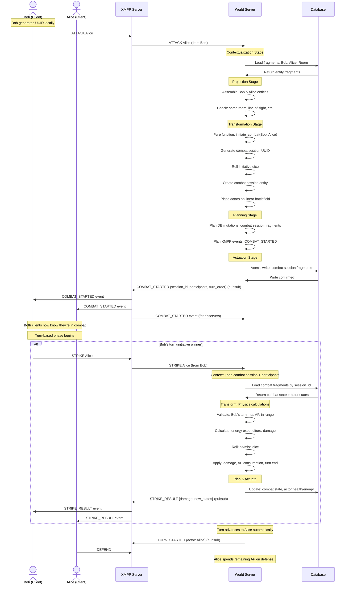

# Combat Sequence

## Normative Case
- No stealth
- Both actors are in the same Place and can see each other

## Key Architectural Benefits

**Unified Command Flow**: All commands flow through the same OLTP pipeline regardless of whether they're combat or non-combat actions.

**Automatic Session Management**: World Server detects when actors are in combat and routes commands appropriately - no client session tracking needed.

**Natural Spatial Integration**: Combat happens within existing XMPP room structure with no separate spatial authority.

**Consistent Performance**: Combat benefits from O(1) batch processing and your proven fragment-based storage system.

**Pure Functional Core**: Combat physics calculations happen in the Transformation stage as pure functions, maintaining your architectural principles.

## Client Simplification

Clients send domain-appropriate commands without session management:
- `ATTACK Alice` (World Server creates session if needed)
- `STRIKE Alice` (World Server knows Bob is in combat with Alice)
- `DEFEND` (World Server applies to current combat session)
- `DODGE` (World Server handles timing and mechanics)

The World Server maintains all combat state as entity fragments and coordinates turn-based flow through the existing event system.
