# Flux Resource Simulation System

## Overview

The Resource Simulation System is one of the [three foundational simulations](./philosophy.md) that comprise the substrate of the game world.

The Resource Simulation System is responsible for:

- Tracking the growth and decay of resources over time
- Determining which resources can grow in a given place
- Managing the distribution of resources across the game world
- Adjusting the growth and decay of resources based on, weather, geological conditions of the place, and actor inputs.

## Core Philosophy

Resources follow a **binary growth/decay state machine** based on environmental conditions, with each resource having specific quantification strategies, environmental requirements, and **fitness thresholds**. The system supports both bulk resources (measured by quantity) and specimen resources (measured by quality), creating diverse resource types with realistic growth patterns.

Resources use **environmental fitness scoring** combined with **fitness thresholds** to determine where they can establish. This creates natural scarcity where common resources appear in many locations, while rare resources only appear in places with excellent environmental alignment.

## Resource Distribution Constraints

### Type-Based Specialization

Each Place can support **only one resource of each type** at any given time. Resource types include:

- **Trees**: `mesquite`, `juniper`, `cottonwood`, `maple`, `oak`
- **Flowers**: `desert-marigold`, `wild-bergamot`, `purple-coneflower`, `orchid`
- **Minerals**: `iron`, `coal`, `tungsten`, `quartz`, `lithium`
- **Fungi**: `truffle`, `desert-puffball`, `chanterelle`, `honey-mushroom`

This constraint creates **natural specialization**:
- A mountain place might have: `mountain-pine` + `iron` + `alpine-aster` + `alpine-bolete`
- A jungle place might have: `mahogany` + `quartz` + `orchid` + `blood-red-cup-fungus`

### Benefits of Type Constraints

**Strategic Scarcity**: Players must explore different Places to find all needed resource types
**Natural Specialization**: Places develop distinct "resource personalities"
**Meaningful Choices**: Harvesting decisions have lasting consequences for Place identity

## Resource Data Model

### ResourceNodes Structure

Each Place maintains resources using URN-based identification with curve position and value tracking:

```typescript
/**
 * A record of the position and value of each resource node in the resource curve
 * We deliberately avoid nesting here and opt instead for URNs to keep the data structure compact.
 */
export type ResourceNodes = Record<ResourceURN, ResourceNodeState> & {
  /**
   * The timestamp of the last update to the resource nodes
   */
  ts: number;
};

export type ResourceNodeState = CurvePositionWithValue & {
  status: ResourceNodeStatus;
};
```

Example ResourceNodes data:
```typescript
{
  'flux:resource:tree:mesquite': {
    position: 0.7,      // Position on growth curve [0-1]
    value: 350,         // Computed resource value (kg of wood)
    status: 'growing',  // 'growing' | 'decaying'
  },
  'flux:resource:flower:desert-marigold': {
    position: 0.3,
    value: 30,          // Number of flowers
    status: 'decaying',
  },
  ts: 1717171717,       // Timestamp of last update
}
```

### Resource Quantification Strategies

Resources use two distinct quantification approaches:

#### Bulk Resources
Measured by total quantity that grows over time:
```typescript
export type BulkQuantificationStrategy = AbstractQuantificationStrategy<'bulk'> & {
  quantity: {
    measure: UnitOfMeasure | UnitOfMass | UnitOfVolume;
    min?: number;    // Minimum quantity (field never completely empty)
    capacity: number; // Maximum quantity (e.g., 200kg of grass)
    curve?: EasingFunctionName; // Optional override of growth.curve
  };
};
```

**Examples**: Grass fields (counted by flowers), water bodies (measured in liters), mineral deposits (measured in kg), tree copses (counted by trees)

#### Specimen Resources
Single items where quality grows over time:
```typescript
export type SpecimenQuantificationStrategy = AbstractQuantificationStrategy<'specimen'> & {
  quantity: {
    measure: UnitOfMeasure.EACH;
    min: 1;
    capacity: 1;
  };
  quality: {
    measure: Exclude<UnitOfMeasure, UnitOfMeasure.EACH> | UnitOfMass | UnitOfVolume;
    min: number;     // Minimum quality (e.g., 0.5kg for smallest fruit)
    capacity: number; // Maximum quality (e.g., 2kg for largest fruit)
  };
};
```

**Examples**: Individual fruit trees, beehives, single large specimens where the quality (size/potency) increases rather than quantity

## Resource Selection Algorithm

When determining which resources can grow in a Place, the system uses **multi-layered environmental fitness scoring** that includes weather conditions, geological compatibility, and fitness thresholds.

### 1. Viability Filtering

First, filter all resources by basic environmental requirements:

```typescript
function getViableResources(
  ecosystem: EcosystemURN,
  weather: Weather
): ResourceSchema[] {
  return ALL_RESOURCES.filter(resource =>
    doesResourceGrowInPlace(resource, ecosystem, weather)
  );
}
```

### 2. Environmental Fitness Scoring

Rate how well each viable resource matches current conditions across multiple dimensions:

```typescript
function calculateEnvironmentalFitness(
  resource: ResourceSchema,
  weather: Weather,
  ecologicalProfile: EcologicalProfile
): number {
  let weatherScore = calculateWeatherFitness(resource, weather);
  let geologicalScore = calculateGeologicalFitness(resource, ecologicalProfile);

  // Combined fitness score
  return (weatherScore + geologicalScore) / 2;
}

function calculateWeatherFitness(resource: ResourceSchema, weather: Weather): number {
  let score = 1.0;

  // Temperature fitness (closer to optimal = higher score)
  const tempRange = resource.requirements.temperature;
  if (tempRange?.min && tempRange?.max) {
    const optimal = (tempRange.min + tempRange.max) / 2;
    const deviation = Math.abs(weather.temperature - optimal);
    score *= Math.max(0, 1 - deviation / 20);
  }

  // Similar calculations for humidity, PPFD, etc.
  return score;
}

function calculateGeologicalFitness(
  resource: ResourceSchema,
  ecologicalProfile: EcologicalProfile
): number {
  let score = 1.0;

  // Soil preference scoring
  if (resource.requirements.soils) {
    let soilScore = 0;
    for (const [soilType, proportion] of Object.entries(ecologicalProfile.soil)) {
      const preference = resource.requirements.soils[soilType] || 0.5; // Default neutral
      soilScore += proportion * preference;
    }
    score *= soilScore;
  }

  // Bedrock preference scoring
  if (resource.requirements.bedrock) {
    let bedrockScore = 0;
    for (const [bedrockType, proportion] of Object.entries(ecologicalProfile.bedrock)) {
      const preference = resource.requirements.bedrock[bedrockType] || 0.5; // Default neutral
      bedrockScore += proportion * preference;
    }
    score *= bedrockScore;
  }

  return score;
}
```

### 3. fitness Threshold Filtering

Check if environmental fitness meets the resource's fitness requirements:

```typescript
function meetsFitnessThreshold(resource: ResourceSchema, fitness: number): boolean {
  return fitness >= (resource.fitness || 0.0);
}
```

### 4. Best-Fit Selection

Select the resource with highest environmental fitness score for each type, considering fitness:

```typescript
function selectResourceByType(
  viableResources: ResourceSchema[],
  resourceType: string,
  weather: Weather,
  ecologicalProfile: EcologicalProfile
): ResourceSchema | null {
  const typeResources = viableResources.filter(r => getResourceType(r) === resourceType);
  if (typeResources.length === 0) return null;

  // Filter by fitness threshold, then select highest fitness
  const eligibleResources = typeResources.filter(resource => {
    const fitness = calculateEnvironmentalFitness(resource, weather, ecologicalProfile);
    return meetsfitnessThreshold(resource, fitness);
  });

  if (eligibleResources.length === 0) return null;

  // Return the resource with highest fitness score
  return eligibleResources.reduce((best, current) => {
    const bestFitness = calculateEnvironmentalFitness(best, weather, ecologicalProfile);
    const currentFitness = calculateEnvironmentalFitness(current, weather, ecologicalProfile);
    return currentFitness > bestFitness ? current : best;
  });
}
```

## Binary Growth/Decay State Machine

Resources have no intermediate states - they are always either **growing** toward capacity or **decaying** toward minimum based on environmental conditions.

### Environmental Condition Checking

```typescript
export function doesResourceGrowInPlace(
  resource: ResourceSchema,
  ecosystem: EcosystemURN,
  weather: Weather
): boolean {
  // ALL requirements must be met for growth
  // ANY failed requirement triggers decay

  const required = resource.requirements;

  // Temperature check
  if (required.temperature?.min && weather.temperature < required.temperature.min) return false;
  if (required.temperature?.max && weather.temperature > required.temperature.max) return false;

  // Humidity, light, seasonal checks...
  return true;
}
```

This creates clear ecological boundaries:
- **ALL growth requirements met** → Resource GROWS
- **ANY growth requirement not met** → Resource DECAYS
- **Immediate response** to environmental changes

## Temporal Integration and Sampling Frequency Independence

The binary growth/decay state machine creates a fundamental challenge: how to apply discrete growth/decay decisions over continuous time intervals without introducing sampling frequency artifacts.

### The Sampling Frequency Problem

Naive implementations apply a single growth/decay decision uniformly over an entire time interval:

```typescript
// Problematic approach:
const isGrowing = doesResourceGrowInPlace(resource, ecosystem, weather_at_sample_time);
const newPosition = calculateNewPosition(state.position, deltaTime, duration);
```

This creates **sampling frequency sensitivity** where resource behavior depends on when updates occur rather than actual environmental conditions:

```typescript
// Weather oscillates: 25°C (growth) → 35°C (decay) → 25°C (growth)
// Resource needs: 20-30°C

// High frequency sampling (every 30 minutes):
// Captures transitions accurately, resource oscillates correctly

// Low frequency sampling (every 3 hours):
// May sample only during 25°C periods, resource grows continuously
// Result differs despite identical environmental conditions
```

### Weather Timestamp Solution

The resource system achieves perfect sampling frequency independence by leveraging precise timing information already present in Weather objects. Each Weather state contains a `ts` timestamp indicating exactly when those conditions became active.

### Event-Driven Temporal Precision

WeatherDidChange events provide both previous and current weather states with their precise timestamps:

```typescript
interface WeatherDidChange {
  payload: {
    from: Weather;  // Previous conditions with from.ts timestamp
    to: Weather;    // New conditions with to.ts timestamp
  };
}
```

The duration of each weather period is calculated exactly:

```typescript
const duration = to.ts - from.ts;  // Precise millisecond duration
```

### Frequency-Independent Resource Updates

Resources are updated using the exact duration each weather state was active:

```typescript
function updateResourceForExactPeriod(
  schema: ResourceSchema,
  weather: Weather,
  durationMs: number,
  state: ResourceNodeState
): ResourceNodeState {
  // Determine growth state for this specific weather period
  const wasGrowing = doesResourceGrowInPlace(schema, ecosystem, weather);

  // Calculate exact position change for precise duration
  const growthDuration = wasGrowing ? schema.growth.duration : schema.decay.duration;
  const positionDelta = (durationMs / durationToMs(growthDuration)) * (wasGrowing ? 1 : -1);

  return {
    ...state,
    position: Math.min(1, Math.max(0, state.position + positionDelta))
  };
}
```

### Mathematical Properties

This approach provides several mathematical guarantees:

**Temporal Precision**: Resource growth reflects the exact duration of each environmental condition rather than approximating through sampling intervals.

**Frequency Independence**: Identical weather sequences produce identical resource states regardless of when updates are processed or how frequently events are sampled.

**Event-Driven Optimization**: Updates occur only when environmental conditions actually change, automatically matching computational frequency to environmental dynamics.

### Integration with Anti-Equilibrium Weather

The frequency-independent approach harmonizes with the anti-equilibrium weather system's rapid environmental changes. Resources respond accurately to weather oscillations and transitions without temporal artifacts, preserving the intended dynamic complexity while maintaining mathematical precision.

This temporal integration method ensures that resource availability patterns emerge purely from environmental fitness relationships rather than simulation artifacts, maintaining the biological authenticity central to the system's design philosophy.

## Growth Curves and Environmental Requirements

### Easing Functions

Resources use mathematical curves to model realistic growth patterns:

```typescript
export const Easing: Record<EasingFunctionName, EasingFunction> = {
  LINEAR: (t: number) => t,                                      // Steady growth
  LOGISTIC: (t: number) => 1 / (1 + Math.exp(-12 * (t - 0.5))), // S-curve
  EXPONENTIAL: (t: number) => /* fast early growth */,           // Rapid colonization
  EASE_OUT_QUAD: (t: number) => 1 - (1 - t) * (1 - t),         // Fast start, slow end
  EASE_IN_QUAD: (t: number) => t * t,                           // Slow start, fast end
  CUBIC: (t: number) => t * t * (3 - 2 * t)                    // Smooth transitions
};
```

**Curve Selection Guidelines:**
- **LOGISTIC**: Most biological growth (flowers, trees) - S-curve with gradual start/end
- **EXPONENTIAL**: Rapid colonization (fungi, pioneer species) - fast early growth
- **LINEAR**: Steady accumulation (minerals, water collection) - constant rate
- **EASE_OUT_QUAD**: Fast establishment with diminishing returns
- **CUBIC**: Smooth acceleration then deceleration

### Environmental Requirements

Resources define comprehensive conditions needed for growth:

```typescript
export type ResourceGrowthRequirements = {
  temperature?: { min?: number, max?: number };     // Celsius
  pressure?: { min?: number, max?: number };        // hectopascals (hPa)
  humidity?: { min?: number, max?: number };        // Percentage (0-100)
  precipitation?: { min?: number, max?: number };   // mm/hour
  ppfd?: { min?: number, max?: number };           // Light (μmol/m²/s)
  clouds?: { min?: number, max?: number };         // Cloud cover (0-100%)
  fog?: { min?: number, max?: number };            // Fog intensity (0-1)
  seasons?: Season[];                              // Active seasons
  time?: TimeOfDay[];                              // Active times of day
  lunar?: LunarPhase[];                            // Lunar phase requirements
  biomes?: Biome[];                                // Ecosystem restrictions
  climates?: Climate[];                            // Climate restrictions
  soils?: { [key: string]: number };               // Soil preferences
  bedrock?: { [key: string]: number };             // Bedrock preferences
};

// Supporting types
export type Season = 'spring' | 'summer' | 'fall' | 'winter';
export type TimeOfDay = 'dawn' | 'morning' | 'day' | 'afternoon' | 'evening' | 'dusk' | 'night';
export type LunarPhase = 'new' | 'waxing' | 'full' | 'waning';
```

## Resource Lifecycle and Succession

### Growth and Decay Mechanics

Resources follow their growth curves when environmental conditions are met:

```typescript
// Growth calculation for bulk resources
const currentQuantity = quantity.min + (growthCurve(position) * (quantity.capacity - quantity.min));

// Growth calculation for specimen resources
const currentQuality = quality.min + (growthCurve(position) * (quality.capacity - quality.min));
```

### Resource Succession

When resources are depleted or environmental conditions change, new resources can establish based on:

- **Environmental fitness** - how well current conditions match requirements
- **Seasonal availability** - resources that can grow in current season
- **Ecosystem compatibility** - biome and climate restrictions
- **Temporal factors** - time of day and lunar phase requirements
- **Type constraints** - only one resource per type allowed

This creates **dynamic resource evolution** where Places develop changing resource compositions over time through natural succession cycles.

## Example Resource Definitions

### Common Bulk Resource (Desert Tree)
```typescript
export const MesquiteSchema: BulkResourceSchema = createTreeSchema({
  name: 'mesquite',
  slug: 'mesquite',
  provides: ['wood', 'bark', 'nectar'],
  fitness: 0.0,  // Common - no fitness requirement
  requirements: {
    temperature: { min: 10, max: 45 },
    humidity: { min: 15, max: 60 },
    precipitation: { min: 0.2 },
    seasons: ['spring', 'summer', 'fall'],
    // Prefers sandy, well-drained soils but can adapt
    soils: {
      'sand:gravelly': 0.9,
      'loam:gravelly': 0.7,
      'sand:stony': 0.6
    }
  },
  growth: {
    curve: 'LOGISTIC',
    duration: [1, TimeUnit.MONTH]  // One month to mature
  },
  quantification: {
    type: 'bulk',
    quantity: {
      measure: UnitOfMeasure.EACH,
      min: 0,         // Can be completely harvested
      capacity: 1000  // Maximum 1000 trees in copse
    }
  }
});
```

### Rare Mineral Resource (Iron Ore)
```typescript
export const IronSchema: BulkResourceSchema = createMineralSchema({
  name: 'iron',
  slug: 'iron',
  provides: ['ore', 'iron'],
  fitness: 0.6,  // Requires "favorable" geological conditions
  requirements: {
    biomes: ['mountain', 'steppe'],
    // Strong preference for iron-bearing rocks
    bedrock: {
      'igneous:basalt': 1.0,      // Excellent - volcanic iron deposits
      'sedimentary:shale': 0.7,    // Good - sedimentary iron bands
      'metamorphic:gneiss': 0.4    // Poor - some metamorphic iron
    },
    // Easier mining with rockier soils
    soils: {
      'sand:lithic': 0.9,    // Excellent accessibility
      'loam:lithic': 0.8,    // Good accessibility
      'clay:stony': 0.6,     // Moderate accessibility
      'sand:gravelly': 0.4   // Poor accessibility
    }
  }
});
```

### Ultra-Rare Specimen Resource (Legendary Fruit)
```typescript
export const DurianTreeSchema: SpecimenResourceSchema = {
  name: 'durian tree',
  slug: 'durian-tree',
  provides: ['fruit'],
  fitness: 0.85, // Very rare - requires near-perfect conditions
  requirements: {
    temperature: { min: 15, max: 35 },
    humidity: { min: 60, max: 90 },
    biomes: ['jungle'],
    climates: ['tropical'],
    // Prefers rich, well-draining tropical soils
    soils: {
      'clay:stony': 0.8,     // Rich tropical clay
      'loam:gravelly': 0.6,  // Well-draining loam
      'silt:gravelly': 0.5   // Acceptable silt
    }
  },
  growth: {
    curve: 'LOGISTIC',
    duration: [7, TimeUnit.DAY]  // 7 days for fruit to ripen
  },
  quantification: {
    type: 'specimen',
    quantity: { measure: UnitOfMeasure.EACH, min: 1, capacity: 1 },
    quality: {
      measure: UnitOfMass.KILOGRAMS,
      min: 0.5,       // Minimum 0.5kg fruit
      capacity: 2.0   // Maximum 2kg premium fruit
    }
  }
};
```

### Complex Environmental Requirements (Mystical Flower)
```typescript
export const BlackLotusSchema: BulkResourceSchema = createFlowerSchema({
  name: 'black lotus',
  slug: 'black-lotus',
  provides: ['flower', 'nectar', 'seeds', 'roots'],
  fitness: 0.95, // Legendary fitness - requires perfect conditions
  requirements: {
    temperature: { min: 15, max: 32 },
    humidity: { min: 60, max: 90 },
    ppfd: { max: 200 },             // Shade-loving
    seasons: ['spring', 'summer', 'fall'],
    time: ['dusk', 'night'],        // Nocturnal blooming
    lunar: ['full'],                // Only during full moon
    // Requires specific mystical geology
    soils: { 'silt:stony': 0.9 },  // Rich organic waterlogged soils
    bedrock: { 'sedimentary:limestone': 0.8 } // Karst formations for mystical energy
  }
});
```

## Ecological Profile Examples

The following examples show how the enhanced geological system creates realistic resource distribution:

`soil` - soil composition by two qualifiers: `type` and `texture`: `type:texture` (e.g., `sand:gravelly`)
`bedrock` - bedrock composition by two qualifiers: `type` and `texture`: `type:texture` (e.g., `igneous:basalt`)

### Mountain Ecosystem
```typescript
'flux:eco:mountain:arid': {
  soil: {
    'sand:lithic': 0.4,     // Thin soil over bedrock
    'loam:lithic': 0.3,     // Patchy fertile areas
    'clay:stony': 0.3       // Rock-filled clay pockets
  },
  bedrock: {
    'metamorphic:gneiss': 0.5,      // High-pressure metamorphic
    'igneous:granite': 0.3,         // Granite intrusions
    'sedimentary:limestone': 0.2    // Uplifted sedimentary
  }
}
```
**Resource Implications**: Excellent for rare metamorphic minerals (tungsten, rare metals), difficult for deep-rooted plants, favors lithophytes and hardy mountain species.

### Jungle Ecosystem
```typescript
'flux:eco:jungle:tropical': {
  soil: {
    'clay:stony': 0.8,      // Deep tropical weathering
    'silt:gravelly': 0.2    // Alluvial deposits
  },
  bedrock: {
    'igneous:basalt': 0.6,         // Volcanic activity
    'sedimentary:limestone': 0.4   // Karst terrain
  }
}
```
**Resource Implications**: Great for iron-rich volcanic minerals, supports lush vegetation, karst areas provide unique mystical resources.

## Benefits of This System

### **Graduated fitness System**
- **Common resources** (fitness 0.0-0.3): Appear in most suitable locations
- **Uncommon resources** (fitness 0.3-0.6): Require good environmental alignment
- **Rare resources** (fitness 0.6-0.8): Only appear in excellent conditions
- **Legendary resources** (fitness 0.8-1.0): Require near-perfect environmental harmony

### **Geological Authenticity**
- Iron appears in basalt-rich volcanic regions and sedimentary iron formations
- Rare metamorphic minerals concentrate in high-pressure mountain zones
- Coal forms in ancient organic sedimentary environments (marshes with shale)
- Common minerals like quartz appear across diverse geological settings

### **Type-Based Specialization**
- Maximum one resource per type per Place eliminates abundance problem
- Forces exploration for specific resource types
- Creates natural Place specialization ("the iron mountain", "the rare herb grove")

### **Environmental Fitness Dynamics**
- Resources that fit conditions better score higher in selection
- Weather and seasonal changes affect resource composition over time
- Geological compatibility creates stable, realistic distribution patterns
- Mining accessibility varies with soil rockiness (lithic > stony > gravelly)

### **Dynamic Succession with Constraints**
- Resource succession creates changing opportunities over time
- Environmental changes can shift which resources can grow
- Depletion decisions have lasting consequences for Place identity
- Fitness thresholds prevent valuable resources from appearing in poor locations

### **Emergent Complexity**
- Places develop distinct geological "personalities" based on their soil and bedrock
- Environmental fitness creates predictable but varied distributions
- Player actions influence long-term resource composition through succession cycles
- Exploration becomes purposeful - seeking specific geological formations for rare resources

The system creates **predictable geological specialization** (rock types determine mineral availability) with **dynamic environmental variety** (weather and succession create changing opportunities), solving the abundance problem while maintaining both ecological and geological authenticity for strategic depth.


# Appendix

## Resource Lifecycle State

```mermaid
sequenceDiagram
    participant ENV as Environment
    participant SVC as ResourceService
    participant UPD as updateResource()
    participant LCS as getLifecycleState()
    participant FIT as calculateFitness()
    participant LOG as Production Logs

    Note over ENV,LOG: Resource Lifecycle: Growth → Decay → Removal

    %% Initial favorable conditions
    ENV->>SVC: Weather conditions favorable<br/>(temp, humidity optimal)
    SVC->>UPD: Update existing/new resource
    UPD->>LCS: Check lifecycle state
    LCS->>FIT: Calculate environmental fitness
    FIT-->>LCS: fitness = 0.8
    Note over LCS: 0.8 >= schema.fitness (0.382)<br/>✅ Threshold met
    LCS-->>UPD: 'growing'
    UPD->>UPD: Apply growth curve<br/>position: 0.0 → 0.3<br/>value increases
    UPD-->>SVC: ResourceNodeState {status: 'growing'}
    SVC->>LOG: 🟢:mineral:quartz {"p":"0.3/+0.1","v":"2.1/+0.5"}

    %% Continued growth
    ENV->>SVC: Conditions remain favorable
    SVC->>UPD: Update resource
    UPD->>LCS: Check lifecycle state
    LCS->>FIT: Calculate environmental fitness
    FIT-->>LCS: fitness = 0.7
    LCS-->>UPD: 'growing'
    UPD->>UPD: Continue growth<br/>position: 0.3 → 0.6<br/>value increases
    UPD-->>SVC: ResourceNodeState {status: 'growing'}
    SVC->>LOG: 🟢:mineral:quartz {"p":"0.6/+0.3","v":"2.8/+0.7"}

    %% Environmental conditions worsen
    ENV->>SVC: Weather becomes unfavorable<br/>(drought, temperature drop)
    SVC->>UPD: Update resource
    UPD->>LCS: Check lifecycle state
    LCS->>FIT: Calculate environmental fitness
    FIT-->>LCS: fitness = 0.2
    Note over LCS: 0.2 < schema.fitness (0.382)<br/>❌ Below threshold
    LCS-->>UPD: 'decaying'
    UPD->>UPD: Apply decay curve<br/>position: 1.0 → 0.8<br/>value decreases proportionally
    UPD-->>SVC: ResourceNodeState {status: 'decaying'}
    SVC->>LOG: 🔴:mineral:quartz {"p":"0.8/-0.2","v":"8.0/-2.0"}

    %% Continued decay
    ENV->>SVC: Conditions remain poor
    SVC->>UPD: Update resource
    UPD->>LCS: Check lifecycle state
    LCS->>FIT: Calculate environmental fitness
    FIT-->>LCS: fitness = 0.1
    LCS-->>UPD: 'decaying'
    UPD->>UPD: Continue decay<br/>position: 0.8 → 0.3<br/>value decreases proportionally
    UPD-->>SVC: ResourceNodeState {status: 'decaying'}
    SVC->>LOG: 🔴:mineral:quartz {"p":"0.3/-0.5","v":"3.0/-5.0"}

    %% Decay completion and removal
    ENV->>SVC: Conditions still poor
    SVC->>UPD: Update resource
    UPD->>LCS: Check lifecycle state
    LCS->>FIT: Calculate environmental fitness
    FIT-->>LCS: fitness = 0.1
    LCS-->>UPD: 'decaying'
    UPD->>UPD: Continue decay<br/>position: 0.3 → 0.0<br/>value → minimum
    Note over UPD: position <= 0.0<br/>🗑️ Decay cycle complete
    UPD-->>SVC: undefined (remove resource)
    SVC->>SVC: delete nodes[resourceUrn]
    Note over SVC,LOG: No log entry - resource removed
```



## Mathematical Growth and Decay Mechanics

### **Critical Implementation Note: Bug Fix Applied**
**FIXED**: A critical bug in `updateBulkResource()` was corrected where decay used an incorrect value calculation formula `capacity - (normalizedProgress * range)` instead of the proper formula.

**Current Implementation**: Both growth and decay now use the **same value calculation formula**: `min + (normalizedProgress * range)`. The directional behavior is handled by position progression, not by inverting the value calculation.

**Impact**: This fix ensures that resources at high decay positions (e.g., 0.948) retain appropriate values rather than incorrectly showing 0 value, maintaining biological authenticity in resource lifecycle behavior.

### Growth Phase
- **Position**: `Tg` advances from `0` → `1` over `growth.duration`
- **Value**: `min + (easing(Tg) * (capacity - min))`
- **Position increments**: `deltaTime / growth.duration`
- **Direction**: Position increases toward `1.0` (full capacity)

### Decay Phase
- **Position**: `Td` advances from current position → `0` over `decay.duration`
- **🔄 Critical Continuity**: `Td` starts at the same position as `Tg` when switching from growth to decay
- **Value**: `min + (easing(Td) * (capacity - min))` *(same formula as growth)*
- **Position decrements**: `deltaTime / decay.duration`
- **Direction**: Position decreases toward `0.0` (approaching minimum)

### **Key Insight: Unified Value Calculation**
Both growth and decay use identical value calculation logic:
```typescript
// BOTH growth and decay use this formula:
newQuantity = min + (normalizedProgress * range);

// The easing function and position progression handle the behavioral differences:
// - Growth: position 0→1, so value goes from min to capacity
// - Decay: position high→0, so value goes from high value down to min
```

### Transition Logic
- **Environmental Switching**: Resource switches between growth/decay based on environmental fitness
- **🔄 Position Continuity**: **Critical** - When switching from growth to decay, `Td` starts at the exact same position as `Tg` (no position reset)
- **Direction Reversal**: Position progression reverses direction but value calculation remains consistent
- **Seamless Transition**: Resource value remains continuous across the growth→decay transition
- **Resource Removal**: Occurs when decay position reaches `≤ 0.0` (decay complete)

### Discrete Quantification (Flowers, Trees, etc.)
For resources measured in discrete units (`UnitOfMeasure.EACH`):
```typescript
// Apply Math.floor() after value calculation
const discreteValue = Math.floor(min + (normalizedProgress * range));
```

This ensures realistic behavior where a flower field at decay position `0.948` retains `~2 flowers` rather than incorrectly showing `0 flowers`.

### Example: Growth-to-Decay Transition
```typescript
// Resource growing: position = 0.7, value = 2.1 flowers
// Environmental conditions worsen → switch to decay
// CRITICAL: Decay starts at position 0.7 (NOT reset to 0)
// As decay progresses: position 0.7 → 0.6 → 0.5 → ... → 0.0
// Value decreases proportionally: 2.1 → 1.8 → 1.5 → ... → 0.0
```

### Mathematical Properties
- **Temporal Precision**: Resources respond to exact weather duration periods
- **Frequency Independence**: Identical weather sequences produce identical outcomes regardless of update frequency
- **Smooth Transitions**: Value remains continuous when switching between growth and decay states
- **Biological Authenticity**: Decay is gradual and proportional, not abrupt

### Corrected Resource Update Flow

```mermaid
graph TD
    A["Resource Update"] --> B{"Environmental<br/>Conditions Met?"}

    B -->|"✅ Yes"| C["Status: 'growing'"]
    B -->|"❌ No"| D["Status: 'decaying'"]

    C --> E["Position: current → 1.0<br/>(+deltaTime/growth.duration)"]
    D --> F["Position: current → 0.0<br/>(-deltaTime/decay.duration)"]

    E --> G["Value Calculation<br/>UNIFIED FORMULA"]
    F --> G

    G --> H["min + (normalizedProgress * range)<br/>📝 SAME for both growth & decay"]

    H --> I{"Discrete Measure?<br/>(UnitOfMeasure.EACH)"}

    I -->|"Yes"| J["Math.floor(value)"]
    I -->|"No"| K["value (continuous)"]

    J --> L["Final Value"]
    K --> L

    L --> M{"Position ≤ 0?<br/>(Decay Complete)"}

    M -->|"Yes"| N["🗑️ Remove Resource"]
    M -->|"No"| O["✅ Update Complete"]

    style G fill:#e1f5fe
    style H fill:#f3e5f5
    style N fill:#ffebee
```


