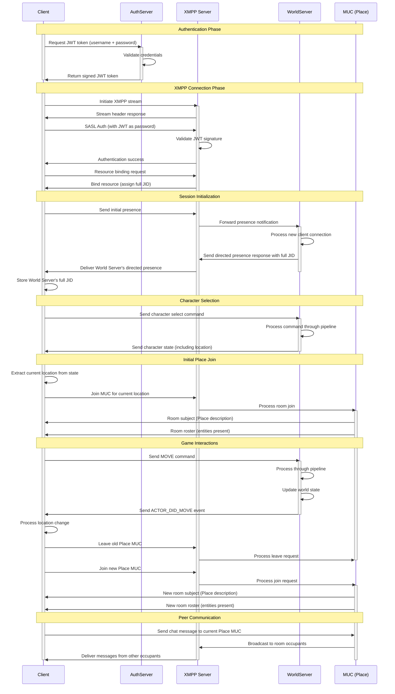

```mermaid
sequenceDiagram
    participant Client
    participant AuthServer
    participant XMPPServer as XMPP Server
    participant WorldServer
    participant MUC as MUC (Place)

    Note over Client, MUC: Authentication Phase
    activate Client
    Client->>AuthServer: Request JWT token (username + password)
    activate AuthServer
    AuthServer->>AuthServer: Validate credentials
    AuthServer->>Client: Return signed JWT token
    deactivate AuthServer
    deactivate Client

    Note over Client, MUC: XMPP Connection Phase
    activate Client
    Client->>XMPPServer: Initiate XMPP stream
    activate XMPPServer
    XMPPServer->>Client: Stream header response
    Client->>XMPPServer: SASL Auth (with JWT as password)
    XMPPServer->>XMPPServer: Validate JWT signature
    XMPPServer->>Client: Authentication success
    Client->>XMPPServer: Resource binding request
    XMPPServer->>Client: Bind resource (assign full JID)

    Note over Client, MUC: Session Initialization
    Client->>XMPPServer: Send initial presence
    XMPPServer->>WorldServer: Forward presence notification
    activate WorldServer
    WorldServer->>WorldServer: Process new client connection
    WorldServer->>XMPPServer: Send directed presence response with full JID
    XMPPServer->>Client: Deliver World Server's directed presence
    deactivate WorldServer
    Client->>Client: Store World Server's full JID

    Note over Client, MUC: Character Selection
    Client->>WorldServer: Send character select command
    activate WorldServer
    WorldServer->>WorldServer: Process command through pipeline
    WorldServer->>Client: Send character state (including location)
    deactivate WorldServer

    Note over Client, MUC: Initial Place Join
    Client->>Client: Extract current location from state
    Client->>XMPPServer: Join MUC for current location
    XMPPServer->>MUC: Process room join
    activate MUC
    MUC->>Client: Room subject (Place description)
    MUC->>Client: Room roster (entities present)

    Note over Client, MUC: Game Interactions
    Client->>WorldServer: Send MOVE command
    activate WorldServer
    WorldServer->>WorldServer: Process through pipeline
    WorldServer->>WorldServer: Update world state
    WorldServer->>Client: Send ACTOR_DID_MOVE event
    deactivate WorldServer

    Client->>Client: Process location change
    Client->>XMPPServer: Leave old Place MUC
    XMPPServer->>MUC: Process leave request
    deactivate MUC
    Client->>XMPPServer: Join new Place MUC
    XMPPServer->>MUC: Process join request
    activate MUC
    MUC->>Client: New room subject (Place description)
    MUC->>Client: New room roster (entities present)

    Note over Client, MUC: Peer Communication
    Client->>MUC: Send chat message to current Place MUC
    MUC->>XMPPServer: Broadcast to room occupants
    XMPPServer->>Client: Deliver messages from other occupants
    deactivate MUC
    deactivate XMPPServer
    deactivate Client
```
